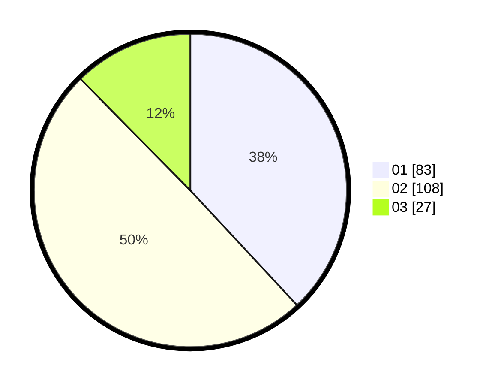

# Hasil

Hasil perolehan suara paslon dapat dilihat pada file paslon-01.txt, paslon-02.txt, dan paslon-03.txt.

Jika tidak ada, artinya data tersebut belum ada pada SIREKAP.

## Perolehan Suara

 * Paslon 01: **83**.
 * Paslon 02: **108**.
 * Paslon 03: **27**.

## Foto C Plano

https://sirekap-obj-formc.kpu.go.id/5c8e/pemilu/ppwp/31/75/10/10/06/3175101006001-20240214-195033--2d206191-76bc-460b-9391-181dca1d6ae5.jpg

https://sirekap-obj-formc.kpu.go.id/5c8e/pemilu/ppwp/31/75/10/10/06/3175101006001-20240214-230752--2ce40911-3d3c-4ee2-b508-0f44412a9410.jpg

https://sirekap-obj-formc.kpu.go.id/5c8e/pemilu/ppwp/31/75/10/10/06/3175101006001-20240214-190837--6cb414a5-b2cb-43bc-8546-0b2a2fd150fc.jpg

## DATA PEMILIH TETAP

Jumlah pemilih dalam DPT: **274**.
 * L: **141**.
 * P: **133**.

## DATA PENGGUNA HAK PILIH

Jumlah pengguna hak pilih dalam DPT: **214**.
 * L: **108**.
 * P: **106**.

Jumlah pengguna hak pilih dalam DPTb: **3**.
 * L: **3**.
 * P: **0**.

Jumlah pengguna hak pilih dalam DPK: **5**.
 * L: **2**.
 * P: **3**.

Jumlah pengguna hak pilih: **222**.
 * L: **113**.
 * P: **107**.

## JUMLAH SUARA SAH DAN TIDAK SAH

JUMLAH SELURUH SUARA SAH: **218**.

JUMLAH SUARA TIDAK SAH: **4**.

JUMLAH SELURUH SUARA SAH DAN SUARA TIDAK SAH: **222**.
