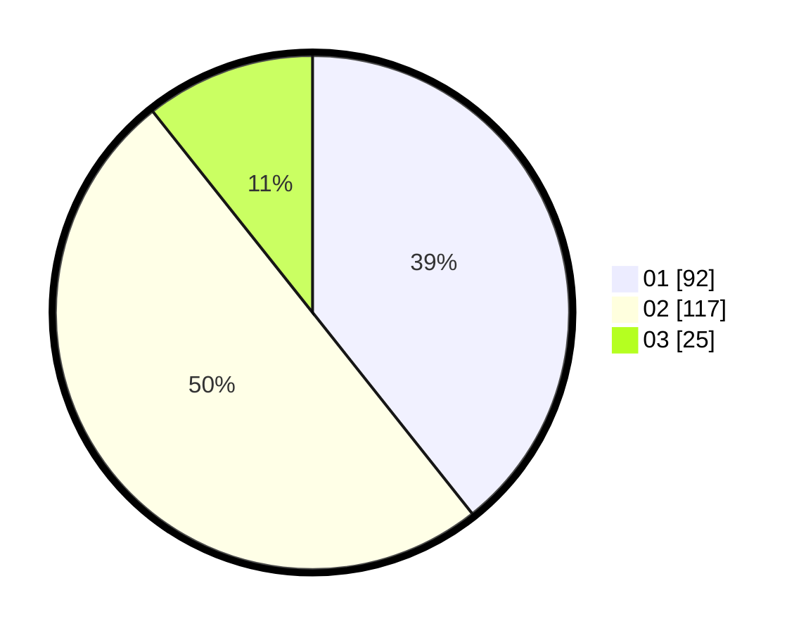

# Hasil

Hasil perolehan suara paslon dapat dilihat pada file paslon-01.txt, paslon-02.txt, dan paslon-03.txt.

Jika tidak ada, artinya data tersebut belum ada pada SIREKAP.

## Perolehan Suara

 * Paslon 01: **92**.
 * Paslon 02: **117**.
 * Paslon 03: **25**.

## Foto C Plano

https://sirekap-obj-formc.kpu.go.id/437d/pemilu/ppwp/31/75/10/10/06/3175101006009-20240215-004152--09b699a3-9325-4c88-b501-ee537b672263.jpg

https://sirekap-obj-formc.kpu.go.id/437d/pemilu/ppwp/31/75/10/10/06/3175101006009-20240215-004313--9f769c59-a32d-440e-9a29-6205d0157c19.jpg

https://sirekap-obj-formc.kpu.go.id/437d/pemilu/ppwp/31/75/10/10/06/3175101006009-20240215-003542--5d99bc42-5f12-4fb2-912c-610eacba54ac.jpg
