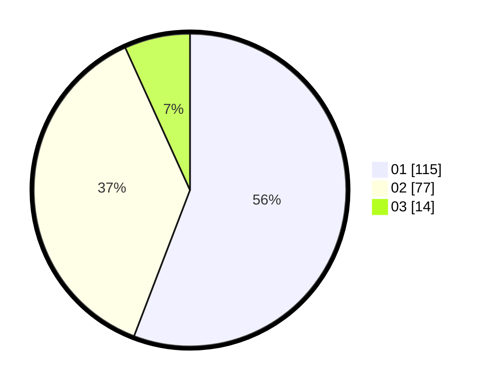

# Hasil

Hasil perolehan suara paslon dapat dilihat pada file paslon-01.txt, paslon-02.txt, dan paslon-03.txt.

Jika tidak ada, artinya data tersebut belum ada pada SIREKAP.

## Perolehan Suara

 * Paslon 01: **115**.
 * Paslon 02: **77**.
 * Paslon 03: **14**.

## Foto C Plano

https://sirekap-obj-formc.kpu.go.id/f2a5/pemilu/ppwp/31/75/10/10/06/3175101006023-20240215-234807--3e0b93c0-4c0f-4dc8-aa4a-8b1b74f27fe6.jpg

https://sirekap-obj-formc.kpu.go.id/f2a5/pemilu/ppwp/31/75/10/10/06/3175101006023-20240215-234810--f899a2ed-50ef-468b-839e-1e9e86072d50.jpg

https://sirekap-obj-formc.kpu.go.id/f2a5/pemilu/ppwp/31/75/10/10/06/3175101006023-20240215-234809--cd46bba5-56e0-42f0-8089-66e3ce79ac3e.jpg

## DATA PEMILIH TETAP

Jumlah pemilih dalam DPT: **269**.
 * L: **121**.
 * P: **148**.

## DATA PENGGUNA HAK PILIH

Jumlah pengguna hak pilih dalam DPT: **209**.
 * L: **90**.
 * P: **119**.

Jumlah pengguna hak pilih dalam DPTb: **0**.
 * L: **0**.
 * P: **0**.

Jumlah pengguna hak pilih dalam DPK: **1**.
 * L: **1**.
 * P: **0**.

Jumlah pengguna hak pilih: **210**.
 * L: **91**.
 * P: **119**.

## JUMLAH SUARA SAH DAN TIDAK SAH

JUMLAH SELURUH SUARA SAH: **206**.

JUMLAH SUARA TIDAK SAH: **4**.

JUMLAH SELURUH SUARA SAH DAN SUARA TIDAK SAH: **210**.
