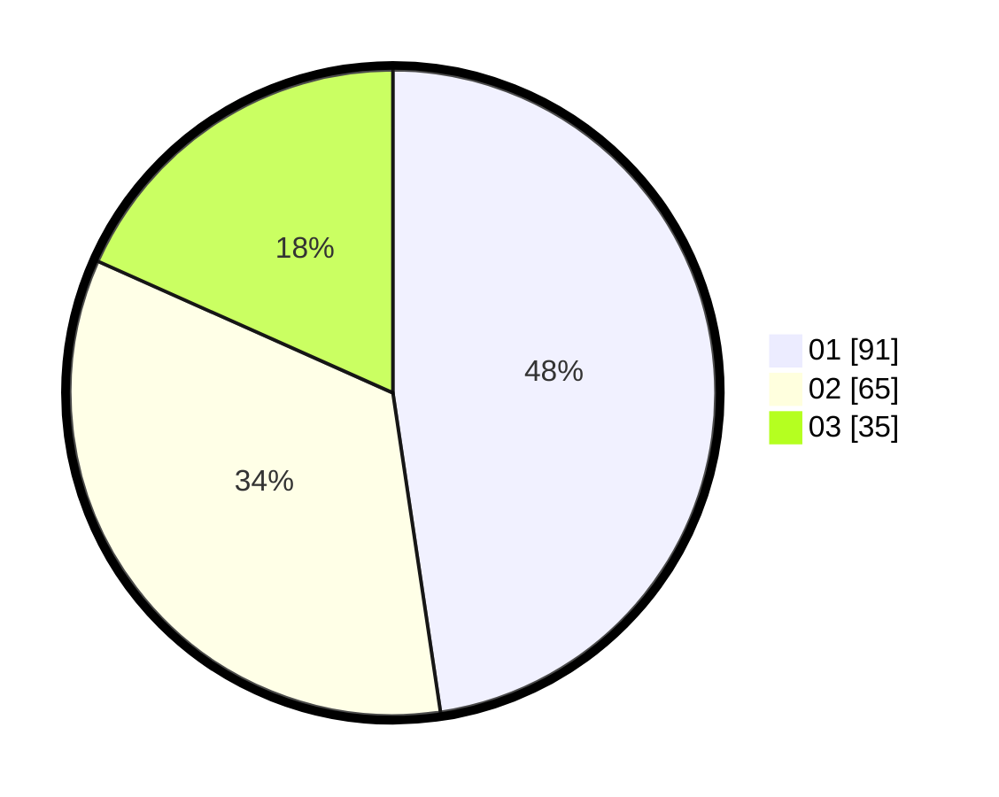

# Hasil

Hasil perolehan suara paslon dapat dilihat pada file paslon-01.txt, paslon-02.txt, dan paslon-03.txt.

Jika tidak ada, artinya data tersebut belum ada pada SIREKAP.

## Perolehan Suara

 * Paslon 01: **91**.
 * Paslon 02: **65**.
 * Paslon 03: **35**.

## Foto C Plano

https://sirekap-obj-formc.kpu.go.id/1c0b/pemilu/ppwp/31/75/10/10/06/3175101006030-20240215-231059--2d31e983-7a63-42e4-9393-16092fc27be2.jpg

https://sirekap-obj-formc.kpu.go.id/1c0b/pemilu/ppwp/31/75/10/10/06/3175101006030-20240215-231102--86bc5a1a-4b93-47b1-9fba-853d3288249f.jpg

https://sirekap-obj-formc.kpu.go.id/1c0b/pemilu/ppwp/31/75/10/10/06/3175101006030-20240215-231101--f0ab8195-702e-4667-8eb1-8f6e7cdf15b0.jpg

## DATA PEMILIH TETAP

Jumlah pemilih dalam DPT: **249**.
 * L: **122**.
 * P: **127**.

## DATA PENGGUNA HAK PILIH

Jumlah pengguna hak pilih dalam DPT: **193**.
 * L: **88**.
 * P: **105**.

Jumlah pengguna hak pilih dalam DPTb: **0**.
 * L: **0**.
 * P: **0**.

Jumlah pengguna hak pilih dalam DPK: **2**.
 * L: **1**.
 * P: **1**.

Jumlah pengguna hak pilih: **195**.
 * L: **89**.
 * P: **106**.

## JUMLAH SUARA SAH DAN TIDAK SAH

JUMLAH SELURUH SUARA SAH: **191**.

JUMLAH SUARA TIDAK SAH: **4**.

JUMLAH SELURUH SUARA SAH DAN SUARA TIDAK SAH: **195**.
