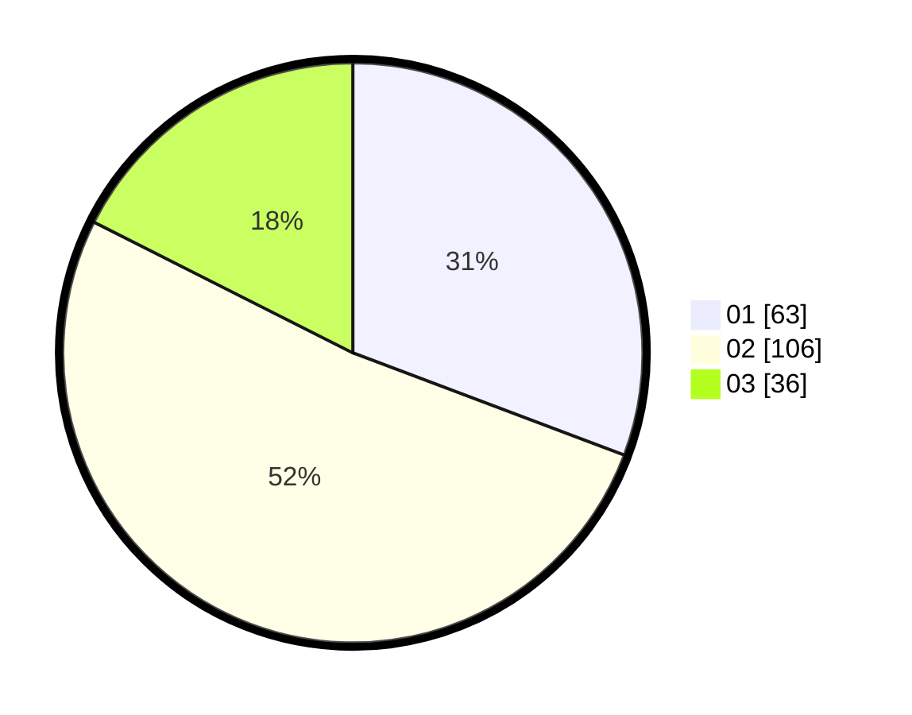

# Hasil

Hasil perolehan suara paslon dapat dilihat pada file paslon-01.txt, paslon-02.txt, dan paslon-03.txt.

Jika tidak ada, artinya data tersebut belum ada pada SIREKAP.

## Perolehan Suara

 * Paslon 01: **63**.
 * Paslon 02: **106**.
 * Paslon 03: **36**.

## Foto C Plano

https://sirekap-obj-formc.kpu.go.id/f4f0/pemilu/ppwp/31/75/10/10/06/3175101006032-20240214-235204--fa2f5f96-1361-46ea-9373-1439308002c4.jpg

https://sirekap-obj-formc.kpu.go.id/f4f0/pemilu/ppwp/31/75/10/10/06/3175101006032-20240214-235341--ef6d9d3c-eb3f-4983-bcb6-0b7cc21842cd.jpg

https://sirekap-obj-formc.kpu.go.id/f4f0/pemilu/ppwp/31/75/10/10/06/3175101006032-20240214-235520--5b10bfc2-15c9-4839-aa39-bd6cccaa0251.jpg
