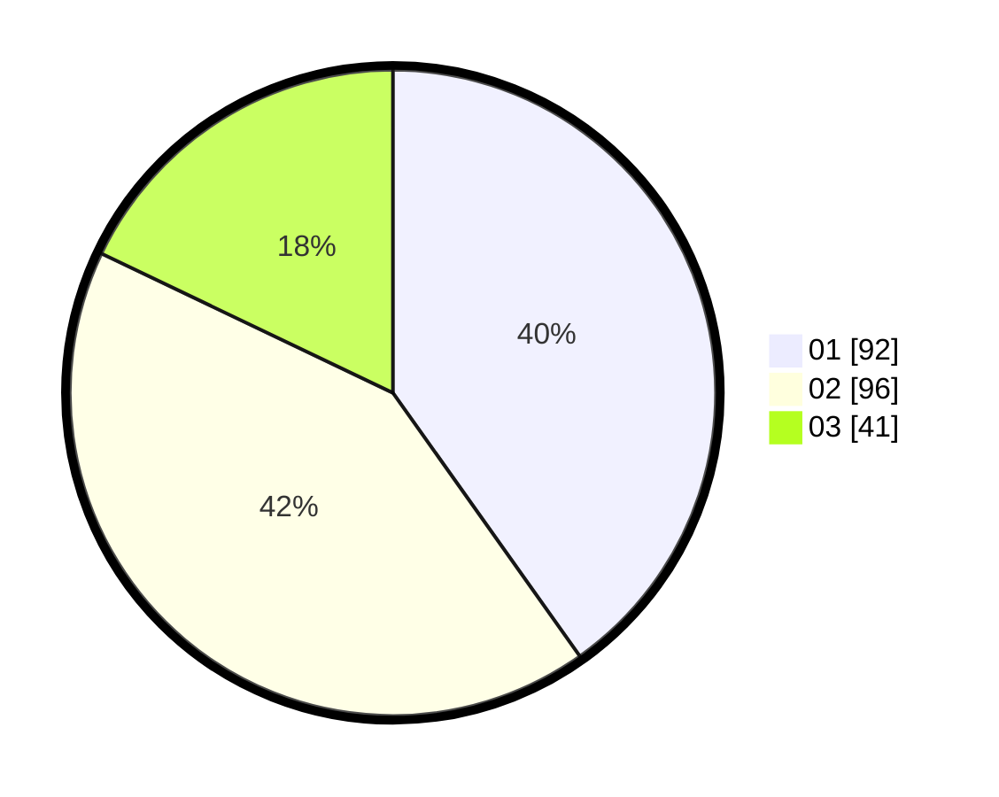

# Hasil

Hasil perolehan suara paslon dapat dilihat pada file paslon-01.txt, paslon-02.txt, dan paslon-03.txt.

Jika tidak ada, artinya data tersebut belum ada pada SIREKAP.

## Perolehan Suara

 * Paslon 01: **92**.
 * Paslon 02: **96**.
 * Paslon 03: **41**.

## Foto C Plano

https://sirekap-obj-formc.kpu.go.id/67c4/pemilu/ppwp/31/75/10/10/06/3175101006057-20240214-155218--0437a7e2-ba5f-49b2-8c5c-196137c09bbd.jpg

https://sirekap-obj-formc.kpu.go.id/67c4/pemilu/ppwp/31/75/10/10/06/3175101006057-20240214-155133--eebc4ae3-8e4e-4ff2-a5a4-01275aa43703.jpg

https://sirekap-obj-formc.kpu.go.id/67c4/pemilu/ppwp/31/75/10/10/06/3175101006057-20240214-155245--b730d754-97ac-4326-a06b-4526a141de0f.jpg

## DATA PEMILIH TETAP

Jumlah pemilih dalam DPT: **244**.
 * L: **113**.
 * P: **131**.

## DATA PENGGUNA HAK PILIH

Jumlah pengguna hak pilih dalam DPT: **218**.
 * L: **97**.
 * P: **121**.

Jumlah pengguna hak pilih dalam DPTb: **4**.
 * L: **3**.
 * P: **1**.

Jumlah pengguna hak pilih dalam DPK: **8**.
 * L: **2**.
 * P: **6**.

Jumlah pengguna hak pilih: **230**.
 * L: **102**.
 * P: **128**.

## JUMLAH SUARA SAH DAN TIDAK SAH

JUMLAH SELURUH SUARA SAH: **229**.

JUMLAH SUARA TIDAK SAH: **1**.

JUMLAH SELURUH SUARA SAH DAN SUARA TIDAK SAH: **230**.
