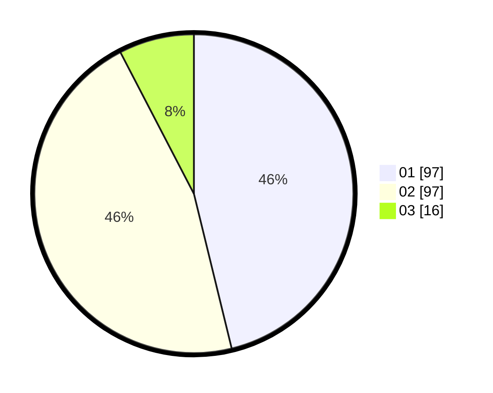

# Hasil

Hasil perolehan suara paslon dapat dilihat pada file paslon-01.txt, paslon-02.txt, dan paslon-03.txt.

Jika tidak ada, artinya data tersebut belum ada pada SIREKAP.

## Perolehan Suara

 * Paslon 01: **97**.
 * Paslon 02: **97**.
 * Paslon 03: **16**.

## Foto C Plano

https://sirekap-obj-formc.kpu.go.id/fa1d/pemilu/ppwp/31/75/10/10/06/3175101006059-20240214-225033--3274b754-2ca7-4581-bc24-b5cb2c124629.jpg

https://sirekap-obj-formc.kpu.go.id/fa1d/pemilu/ppwp/31/75/10/10/06/3175101006059-20240214-225300--ce07e647-5475-4c83-a7df-c4170914d2cc.jpg

https://sirekap-obj-formc.kpu.go.id/fa1d/pemilu/ppwp/31/75/10/10/06/3175101006059-20240214-224820--9b45f2b9-4a78-4e9c-97f7-3f4fafb5baff.jpg
