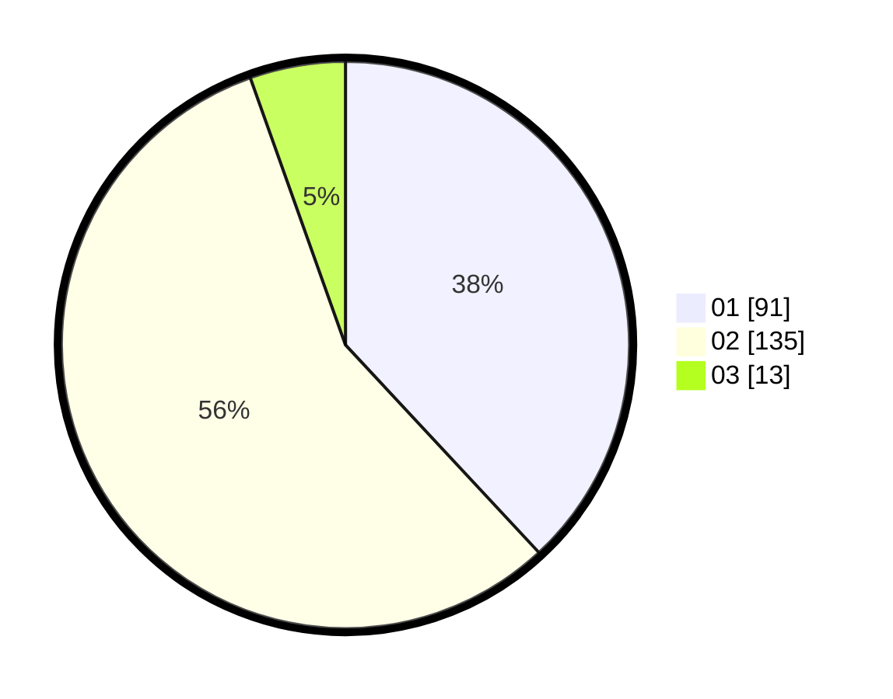

# Hasil

Hasil perolehan suara paslon dapat dilihat pada file paslon-01.txt, paslon-02.txt, dan paslon-03.txt.

Jika tidak ada, artinya data tersebut belum ada pada SIREKAP.

## Perolehan Suara

 * Paslon 01: **91**.
 * Paslon 02: **135**.
 * Paslon 03: **13**.

## Foto C Plano

https://sirekap-obj-formc.kpu.go.id/d466/pemilu/ppwp/31/75/10/10/06/3175101006079-20240214-214533--558738f4-7057-42bc-9c5a-4ca958bb7501.jpg

https://sirekap-obj-formc.kpu.go.id/d466/pemilu/ppwp/31/75/10/10/06/3175101006079-20240214-214536--ad851110-e8f8-4bc8-9404-a2d47917daf1.jpg

https://sirekap-obj-formc.kpu.go.id/d466/pemilu/ppwp/31/75/10/10/06/3175101006079-20240214-214539--5a2de929-1c4d-4c70-9e47-6d37e5b66994.jpg

## DATA PEMILIH TETAP

Jumlah pemilih dalam DPT: **279**.
 * L: **141**.
 * P: **138**.

## DATA PENGGUNA HAK PILIH

Jumlah pengguna hak pilih dalam DPT: **235**.
 * L: **120**.
 * P: **115**.

Jumlah pengguna hak pilih dalam DPTb: **1**.
 * L: **0**.
 * P: **1**.

Jumlah pengguna hak pilih dalam DPK: **6**.
 * L: **3**.
 * P: **3**.

Jumlah pengguna hak pilih: **242**.
 * L: **123**.
 * P: **119**.

## JUMLAH SUARA SAH DAN TIDAK SAH

JUMLAH SELURUH SUARA SAH: **239**.

JUMLAH SUARA TIDAK SAH: **3**.

JUMLAH SELURUH SUARA SAH DAN SUARA TIDAK SAH: **242**.
