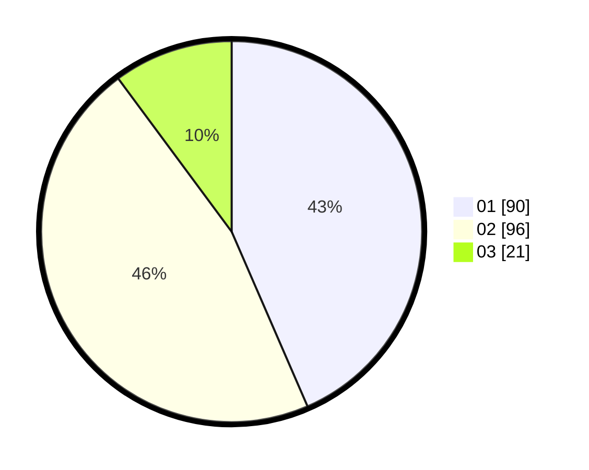

# Hasil

Hasil perolehan suara paslon dapat dilihat pada file paslon-01.txt, paslon-02.txt, dan paslon-03.txt.

Jika tidak ada, artinya data tersebut belum ada pada SIREKAP.

## Perolehan Suara

 * Paslon 01: **90**.
 * Paslon 02: **96**.
 * Paslon 03: **21**.

## Foto C Plano

https://sirekap-obj-formc.kpu.go.id/0940/pemilu/ppwp/31/75/10/10/06/3175101006094-20240214-211310--40b596c5-b76c-4f6e-be91-2839af997bd6.jpg

https://sirekap-obj-formc.kpu.go.id/0940/pemilu/ppwp/31/75/10/10/06/3175101006094-20240214-211334--6a61a9f3-d5a7-48a9-85f1-c04594705721.jpg

https://sirekap-obj-formc.kpu.go.id/0940/pemilu/ppwp/31/75/10/10/06/3175101006094-20240214-211359--d9d52b1c-b7f3-4115-a008-be2550aa808c.jpg
