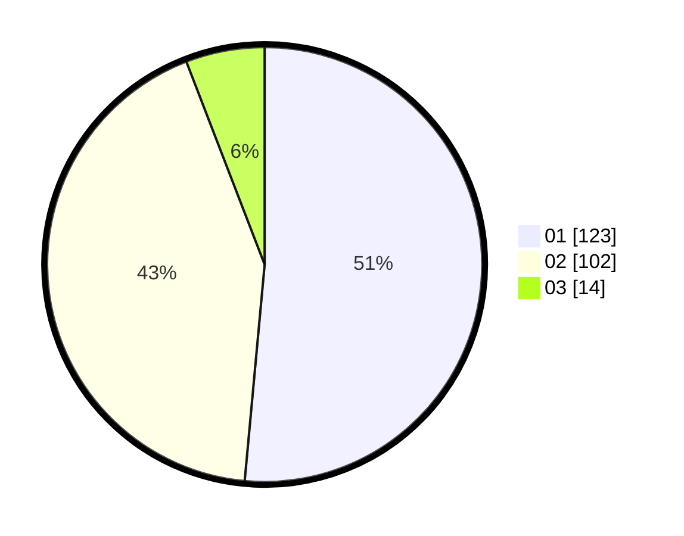

# Hasil

Hasil perolehan suara paslon dapat dilihat pada file paslon-01.txt, paslon-02.txt, dan paslon-03.txt.

Jika tidak ada, artinya data tersebut belum ada pada SIREKAP.

## Perolehan Suara

 * Paslon 01: **123**.
 * Paslon 02: **102**.
 * Paslon 03: **14**.

## Foto C Plano

https://sirekap-obj-formc.kpu.go.id/b376/pemilu/ppwp/31/75/10/10/07/3175101007002-20240215-042840--0a146cd8-2988-4dd5-9050-32e91843aab6.jpg

https://sirekap-obj-formc.kpu.go.id/b376/pemilu/ppwp/31/75/10/10/07/3175101007002-20240215-042944--3273bf6f-af83-41e9-9ae2-36fc64195a4c.jpg

https://sirekap-obj-formc.kpu.go.id/b376/pemilu/ppwp/31/75/10/10/07/3175101007002-20240215-043035--07e4efac-8ce0-4280-acb7-5b5b52f9ef95.jpg
