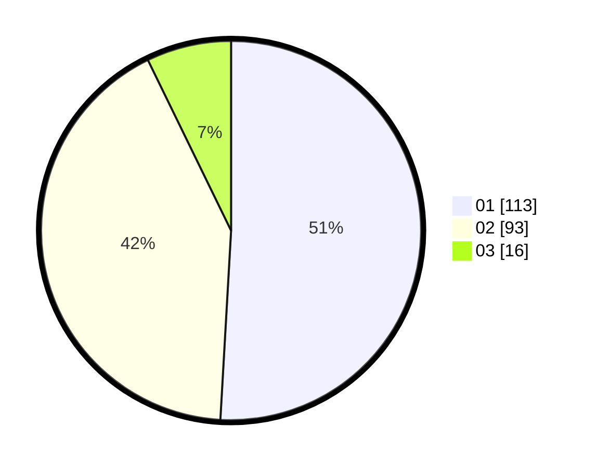

# Hasil

Hasil perolehan suara paslon dapat dilihat pada file paslon-01.txt, paslon-02.txt, dan paslon-03.txt.

Jika tidak ada, artinya data tersebut belum ada pada SIREKAP.

## Perolehan Suara

 * Paslon 01: **113**.
 * Paslon 02: **93**.
 * Paslon 03: **16**.

## Foto C Plano

https://sirekap-obj-formc.kpu.go.id/c692/pemilu/ppwp/31/75/10/10/07/3175101007003-20240214-231746--4380d641-b86e-49c5-a7d7-0d7f4e1520e5.jpg

https://sirekap-obj-formc.kpu.go.id/c692/pemilu/ppwp/31/75/10/10/07/3175101007003-20240216-111537--6c4773f8-51db-46f0-aff2-b4d9fc15c7bc.jpg

https://sirekap-obj-formc.kpu.go.id/c692/pemilu/ppwp/31/75/10/10/07/3175101007003-20240216-112601--7ec8df4a-909a-4a1f-ba89-3956d443f1da.jpg

## DATA PEMILIH TETAP

Jumlah pemilih dalam DPT: **285**.
 * L: **117**.
 * P: **168**.

## DATA PENGGUNA HAK PILIH

Jumlah pengguna hak pilih dalam DPT: **221**.
 * L: **96**.
 * P: **125**.

Jumlah pengguna hak pilih dalam DPTb: **3**.
 * L: **2**.
 * P: **1**.

Jumlah pengguna hak pilih dalam DPK: **0**.
 * L: **0**.
 * P: **0**.

Jumlah pengguna hak pilih: **224**.
 * L: **98**.
 * P: **126**.

## JUMLAH SUARA SAH DAN TIDAK SAH

JUMLAH SELURUH SUARA SAH: **222**.

JUMLAH SUARA TIDAK SAH: **2**.

JUMLAH SELURUH SUARA SAH DAN SUARA TIDAK SAH: **224**.
