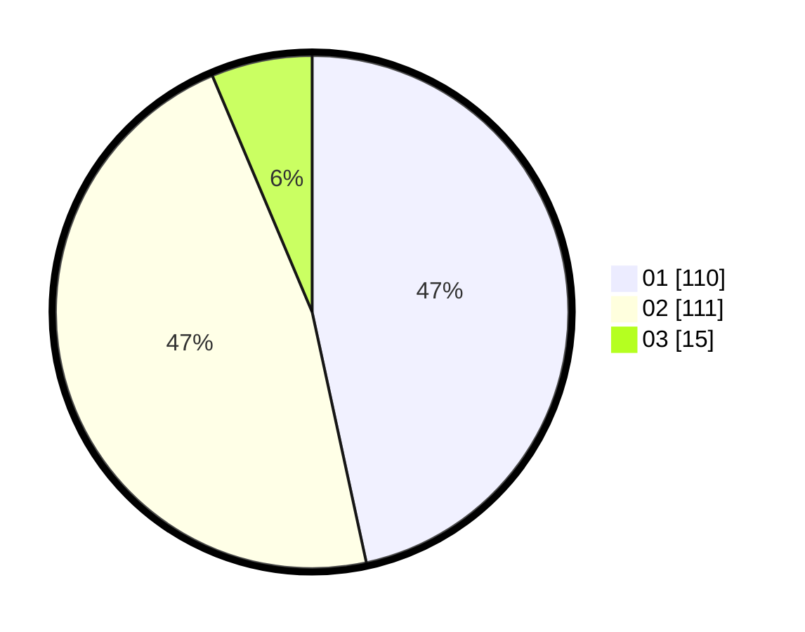

# Hasil

Hasil perolehan suara paslon dapat dilihat pada file paslon-01.txt, paslon-02.txt, dan paslon-03.txt.

Jika tidak ada, artinya data tersebut belum ada pada SIREKAP.

## Perolehan Suara

 * Paslon 01: **110**.
 * Paslon 02: **111**.
 * Paslon 03: **15**.

## Foto C Plano

https://sirekap-obj-formc.kpu.go.id/5779/pemilu/ppwp/31/75/10/10/07/3175101007006-20240214-213140--40d2c03e-69b8-4f75-ad4c-4cd52c315cb7.jpg

https://sirekap-obj-formc.kpu.go.id/5779/pemilu/ppwp/31/75/10/10/07/3175101007006-20240214-200658--8cc7d5c7-e440-43c9-b971-a7002e1a2904.jpg

https://sirekap-obj-formc.kpu.go.id/5779/pemilu/ppwp/31/75/10/10/07/3175101007006-20240214-213211--b2d95c3a-f68e-4ff9-985d-a379d491a76a.jpg
