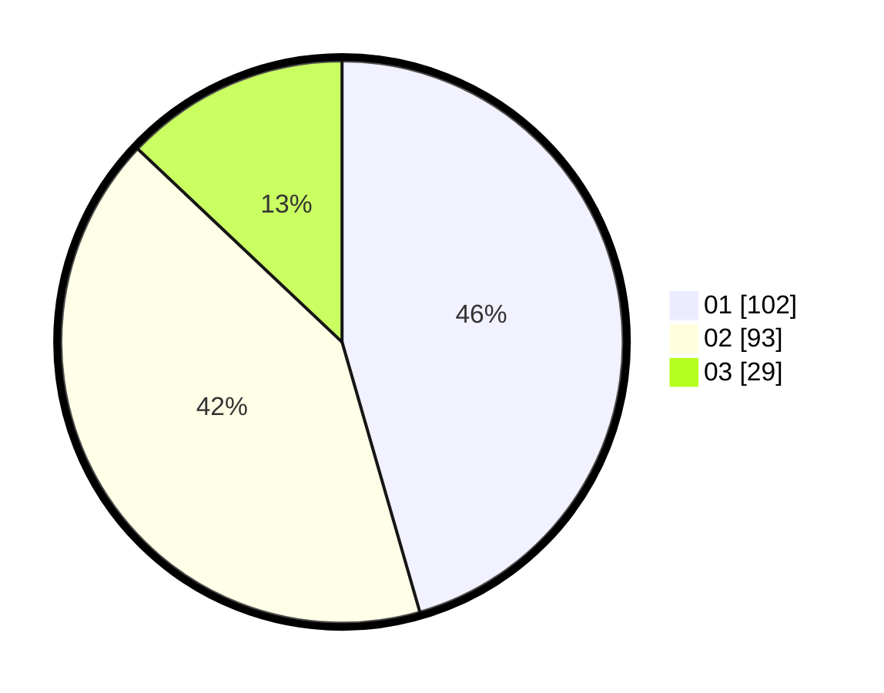

# Hasil

Hasil perolehan suara paslon dapat dilihat pada file paslon-01.txt, paslon-02.txt, dan paslon-03.txt.

Jika tidak ada, artinya data tersebut belum ada pada SIREKAP.

## Perolehan Suara

 * Paslon 01: **102**.
 * Paslon 02: **93**.
 * Paslon 03: **29**.

## Foto C Plano

https://sirekap-obj-formc.kpu.go.id/aad4/pemilu/ppwp/31/75/10/10/07/3175101007008-20240215-154305--63010f91-c8f0-4a1d-b97d-7bf905690960.jpg

https://sirekap-obj-formc.kpu.go.id/aad4/pemilu/ppwp/31/75/10/10/07/3175101007008-20240215-154458--7770f0cc-c32d-460d-a34f-cc26c94348c7.jpg

https://sirekap-obj-formc.kpu.go.id/aad4/pemilu/ppwp/31/75/10/10/07/3175101007008-20240215-154916--445452a0-8fe1-4556-9e47-468ca9061635.jpg
