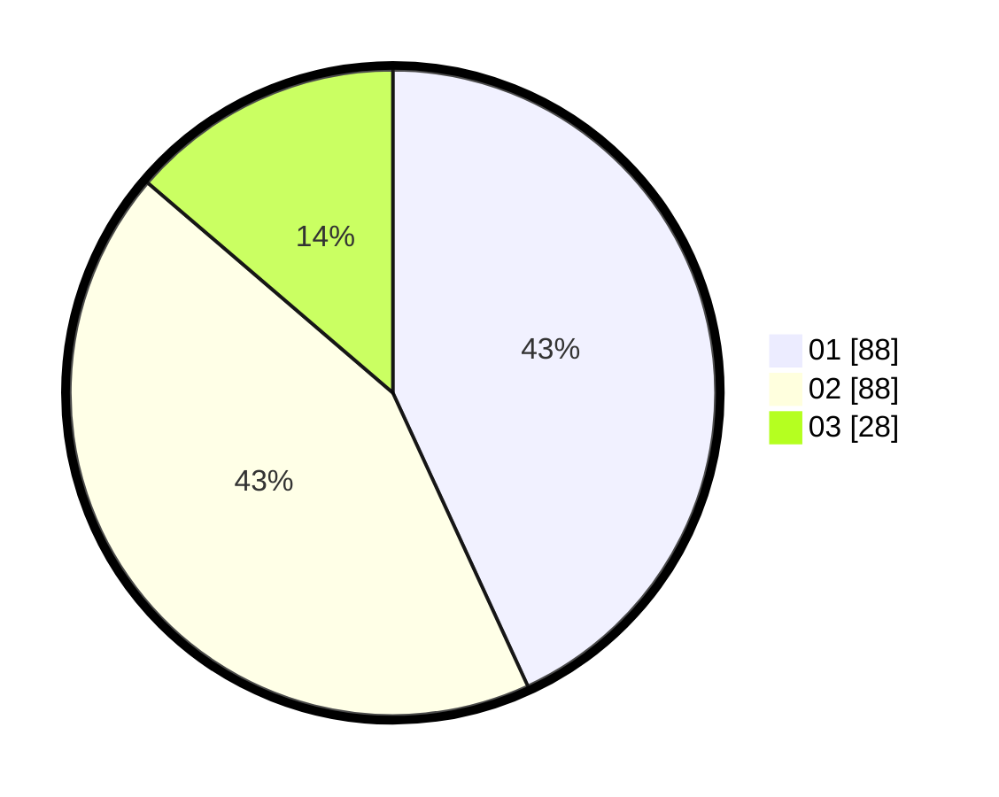

# Hasil

Hasil perolehan suara paslon dapat dilihat pada file paslon-01.txt, paslon-02.txt, dan paslon-03.txt.

Jika tidak ada, artinya data tersebut belum ada pada SIREKAP.

## Perolehan Suara

 * Paslon 01: **88**.
 * Paslon 02: **88**.
 * Paslon 03: **28**.

## Foto C Plano

https://sirekap-obj-formc.kpu.go.id/bbb3/pemilu/ppwp/31/75/10/10/07/3175101007009-20240217-204541--4b75937d-c101-4183-b18d-166567267a98.jpg

https://sirekap-obj-formc.kpu.go.id/bbb3/pemilu/ppwp/31/75/10/10/07/3175101007009-20240217-204543--deddb38f-42fe-4e6f-8eec-8e056366aaa4.jpg

https://sirekap-obj-formc.kpu.go.id/bbb3/pemilu/ppwp/31/75/10/10/07/3175101007009-20240217-204542--21b43381-cc66-450d-8353-38d164552752.jpg

## DATA PEMILIH TETAP

Jumlah pemilih dalam DPT: **265**.
 * L: **124**.
 * P: **141**.

## DATA PENGGUNA HAK PILIH

Jumlah pengguna hak pilih dalam DPT: **206**.
 * L: **91**.
 * P: **115**.

Jumlah pengguna hak pilih dalam DPTb: **1**.
 * L: **0**.
 * P: **1**.

Jumlah pengguna hak pilih dalam DPK: **0**.
 * L: **0**.
 * P: **0**.

Jumlah pengguna hak pilih: **207**.
 * L: **91**.
 * P: **116**.

## JUMLAH SUARA SAH DAN TIDAK SAH

JUMLAH SELURUH SUARA SAH: **204**.

JUMLAH SUARA TIDAK SAH: **3**.

JUMLAH SELURUH SUARA SAH DAN SUARA TIDAK SAH: **207**.
