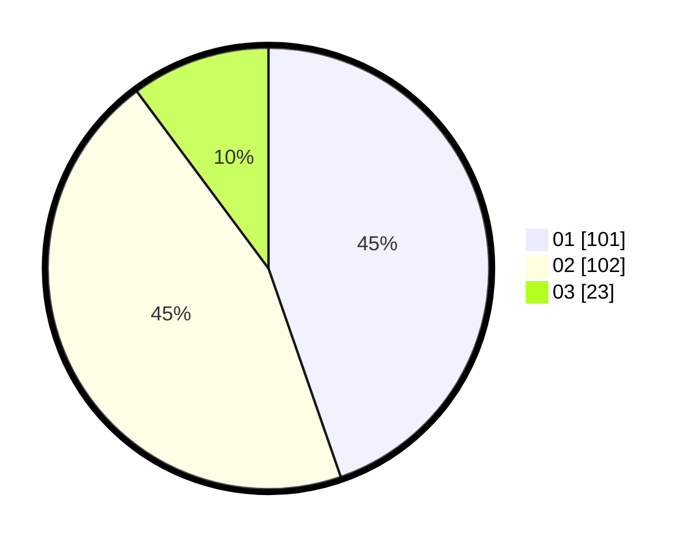

# Hasil

Hasil perolehan suara paslon dapat dilihat pada file paslon-01.txt, paslon-02.txt, dan paslon-03.txt.

Jika tidak ada, artinya data tersebut belum ada pada SIREKAP.

## Perolehan Suara

 * Paslon 01: **101**.
 * Paslon 02: **102**.
 * Paslon 03: **23**.

## Foto C Plano

https://sirekap-obj-formc.kpu.go.id/9556/pemilu/ppwp/31/75/10/10/07/3175101007011-20240215-052318--dae7c3b6-36d5-4c36-bbea-89cc97b3244b.jpg

https://sirekap-obj-formc.kpu.go.id/9556/pemilu/ppwp/31/75/10/10/07/3175101007011-20240215-052342--5c34e85b-1b5a-4311-9173-61aafa87ae5d.jpg

https://sirekap-obj-formc.kpu.go.id/9556/pemilu/ppwp/31/75/10/10/07/3175101007011-20240215-052400--c88a81fe-f27a-4267-95ea-91d41465e425.jpg
