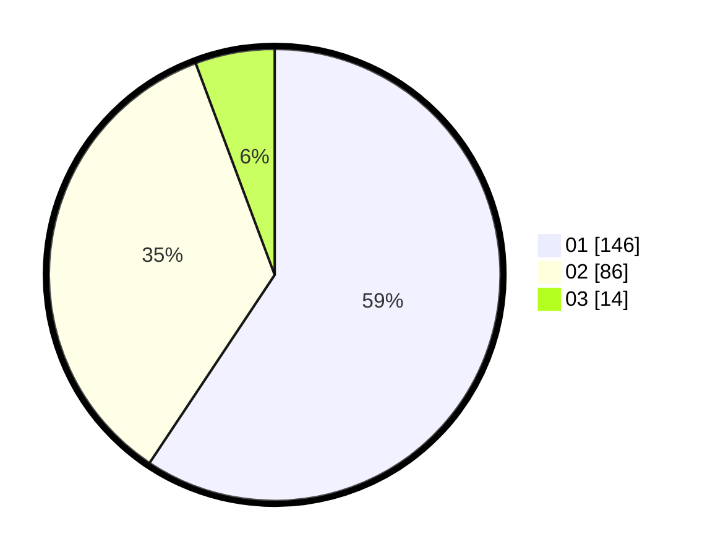

# Hasil

Hasil perolehan suara paslon dapat dilihat pada file paslon-01.txt, paslon-02.txt, dan paslon-03.txt.

Jika tidak ada, artinya data tersebut belum ada pada SIREKAP.

## Perolehan Suara

 * Paslon 01: **146**.
 * Paslon 02: **86**.
 * Paslon 03: **14**.

## Foto C Plano

https://sirekap-obj-formc.kpu.go.id/d9d7/pemilu/ppwp/31/75/10/10/07/3175101007012-20240217-101301--7e159d50-2e03-4a25-863e-1edd23d6b4cc.jpg

https://sirekap-obj-formc.kpu.go.id/d9d7/pemilu/ppwp/31/75/10/10/07/3175101007012-20240214-155354--0948bb0d-27a1-49b9-a493-b90fe4922818.jpg

https://sirekap-obj-formc.kpu.go.id/d9d7/pemilu/ppwp/31/75/10/10/07/3175101007012-20240214-155500--158112b3-595b-4a97-89fe-616cbb4fc175.jpg

## DATA PEMILIH TETAP

Jumlah pemilih dalam DPT: **293**.
 * L: **133**.
 * P: **160**.

## DATA PENGGUNA HAK PILIH

Jumlah pengguna hak pilih dalam DPT: **248**.
 * L: **107**.
 * P: **141**.

Jumlah pengguna hak pilih dalam DPTb: **0**.
 * L: **0**.
 * P: **0**.

Jumlah pengguna hak pilih dalam DPK: **0**.
 * L: **0**.
 * P: **0**.

Jumlah pengguna hak pilih: **248**.
 * L: **107**.
 * P: **141**.

## JUMLAH SUARA SAH DAN TIDAK SAH

JUMLAH SELURUH SUARA SAH: **246**.

JUMLAH SUARA TIDAK SAH: **2**.

JUMLAH SELURUH SUARA SAH DAN SUARA TIDAK SAH: **248**.
