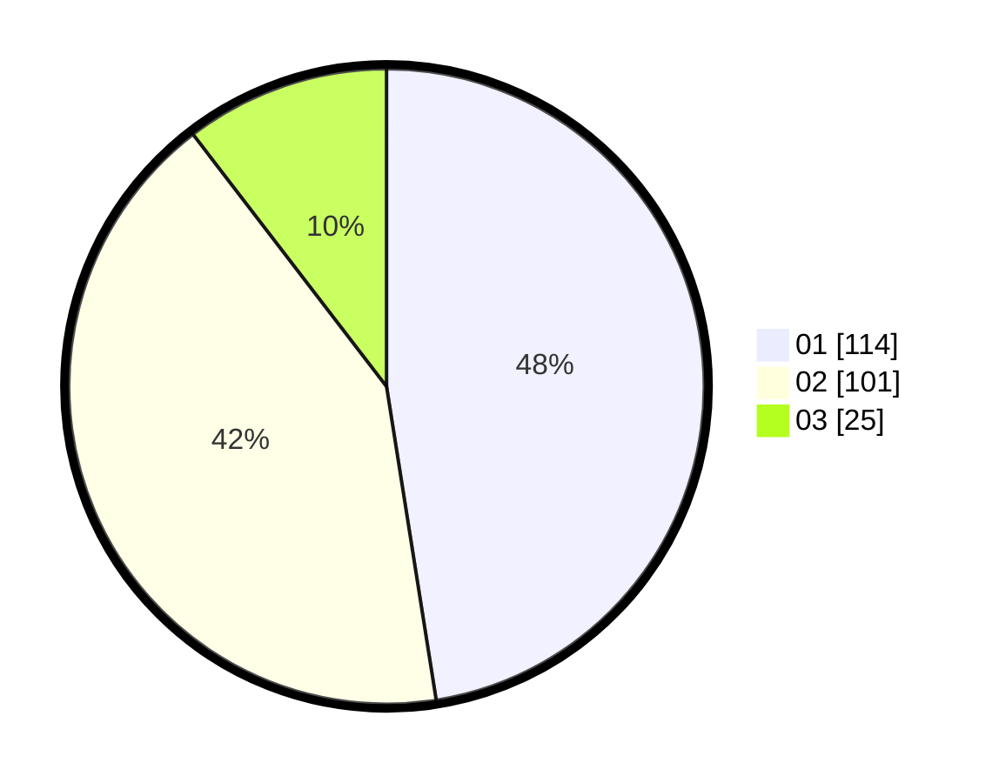

# Hasil

Hasil perolehan suara paslon dapat dilihat pada file paslon-01.txt, paslon-02.txt, dan paslon-03.txt.

Jika tidak ada, artinya data tersebut belum ada pada SIREKAP.

## Perolehan Suara

 * Paslon 01: **114**.
 * Paslon 02: **101**.
 * Paslon 03: **25**.

## Foto C Plano

https://sirekap-obj-formc.kpu.go.id/89a2/pemilu/ppwp/31/75/10/10/07/3175101007013-20240214-210246--c733eb13-4c67-4f02-a131-5c2924011fd5.jpg

https://sirekap-obj-formc.kpu.go.id/89a2/pemilu/ppwp/31/75/10/10/07/3175101007013-20240214-210140--912b8244-8bfa-46e2-a313-acfb6077a007.jpg

https://sirekap-obj-formc.kpu.go.id/89a2/pemilu/ppwp/31/75/10/10/07/3175101007013-20240214-210230--1858e90e-8742-4696-b8ca-03da00b26ce9.jpg
