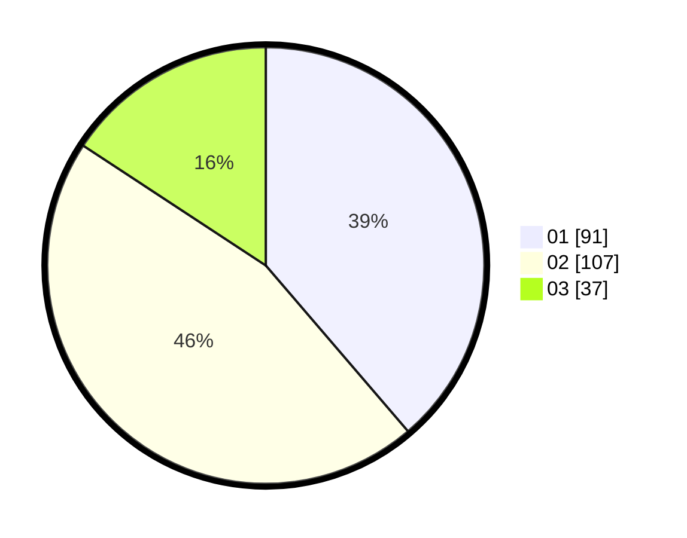

# Hasil

Hasil perolehan suara paslon dapat dilihat pada file paslon-01.txt, paslon-02.txt, dan paslon-03.txt.

Jika tidak ada, artinya data tersebut belum ada pada SIREKAP.

## Perolehan Suara

 * Paslon 01: **91**.
 * Paslon 02: **107**.
 * Paslon 03: **37**.

## Foto C Plano

https://sirekap-obj-formc.kpu.go.id/9eaa/pemilu/ppwp/31/75/10/10/07/3175101007025-20240215-002048--c6e4d091-b9b5-420d-863b-21321ee29493.jpg

https://sirekap-obj-formc.kpu.go.id/9eaa/pemilu/ppwp/31/75/10/10/07/3175101007025-20240215-002143--3f50aacf-e274-4822-bae3-8fe043292246.jpg

https://sirekap-obj-formc.kpu.go.id/9eaa/pemilu/ppwp/31/75/10/10/07/3175101007025-20240215-002217--8b115068-6183-49ad-9e6f-84122ca05cc6.jpg

## DATA PEMILIH TETAP

Jumlah pemilih dalam DPT: **291**.
 * L: **141**.
 * P: **150**.

## DATA PENGGUNA HAK PILIH

Jumlah pengguna hak pilih dalam DPT: **235**.
 * L: **111**.
 * P: **124**.

Jumlah pengguna hak pilih dalam DPTb: **2**.
 * L: **1**.
 * P: **1**.

Jumlah pengguna hak pilih dalam DPK: **4**.
 * L: **3**.
 * P: **1**.

Jumlah pengguna hak pilih: **241**.
 * L: **115**.
 * P: **126**.

## JUMLAH SUARA SAH DAN TIDAK SAH

JUMLAH SELURUH SUARA SAH: **235**.

JUMLAH SUARA TIDAK SAH: **6**.

JUMLAH SELURUH SUARA SAH DAN SUARA TIDAK SAH: **241**.
