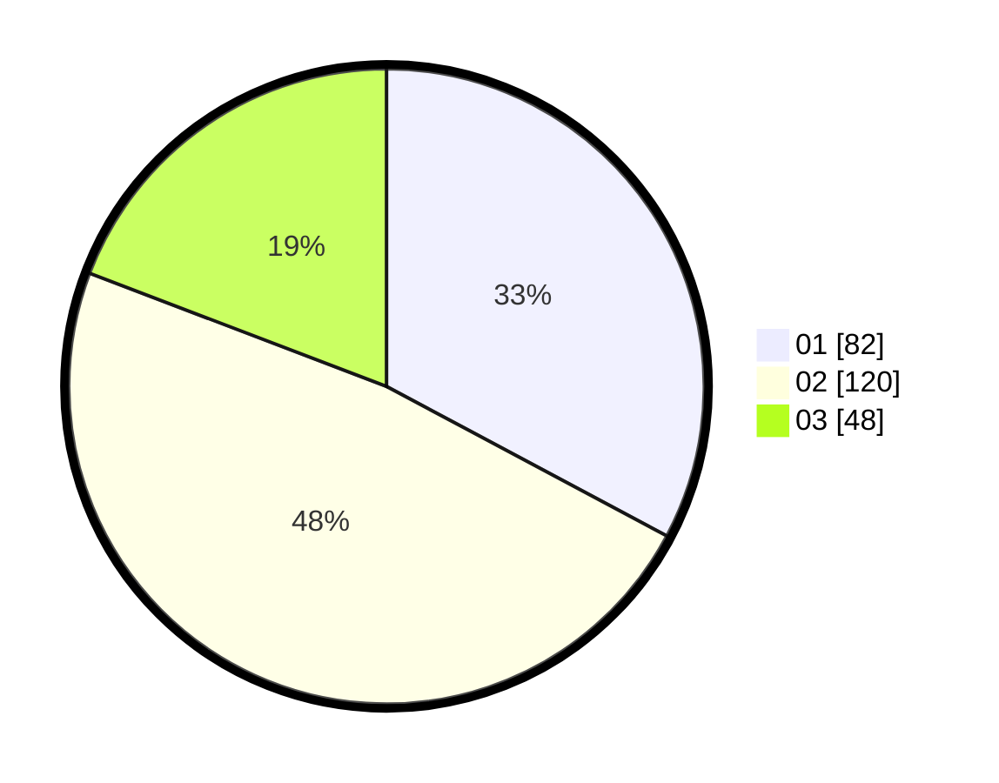

# Hasil

Hasil perolehan suara paslon dapat dilihat pada file paslon-01.txt, paslon-02.txt, dan paslon-03.txt.

Jika tidak ada, artinya data tersebut belum ada pada SIREKAP.

## Perolehan Suara

 * Paslon 01: **82**.
 * Paslon 02: **120**.
 * Paslon 03: **48**.

## Foto C Plano

https://sirekap-obj-formc.kpu.go.id/5ea0/pemilu/ppwp/31/75/10/10/07/3175101007032-20240216-002611--1cd68ddf-d6ca-477f-860b-8d63006c7c96.jpg

https://sirekap-obj-formc.kpu.go.id/5ea0/pemilu/ppwp/31/75/10/10/07/3175101007032-20240216-002613--b0779435-331f-46aa-b207-ae4222db2084.jpg

https://sirekap-obj-formc.kpu.go.id/5ea0/pemilu/ppwp/31/75/10/10/07/3175101007032-20240216-002612--5ee18377-75a0-41eb-9413-7a50a0130e73.jpg

## DATA PEMILIH TETAP

Jumlah pemilih dalam DPT: **295**.
 * L: **146**.
 * P: **149**.

## DATA PENGGUNA HAK PILIH

Jumlah pengguna hak pilih dalam DPT: **246**.
 * L: **122**.
 * P: **124**.

Jumlah pengguna hak pilih dalam DPTb: **5**.
 * L: **2**.
 * P: **3**.

Jumlah pengguna hak pilih dalam DPK: **0**.
 * L: **0**.
 * P: **0**.

Jumlah pengguna hak pilih: **251**.
 * L: **124**.
 * P: **127**.

## JUMLAH SUARA SAH DAN TIDAK SAH

JUMLAH SELURUH SUARA SAH: **250**.

JUMLAH SUARA TIDAK SAH: **1**.

JUMLAH SELURUH SUARA SAH DAN SUARA TIDAK SAH: **251**.
