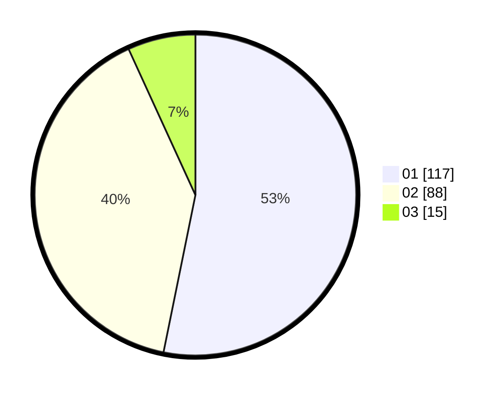

# Hasil

Hasil perolehan suara paslon dapat dilihat pada file paslon-01.txt, paslon-02.txt, dan paslon-03.txt.

Jika tidak ada, artinya data tersebut belum ada pada SIREKAP.

## Perolehan Suara

 * Paslon 01: **117**.
 * Paslon 02: **88**.
 * Paslon 03: **15**.

## Foto C Plano

https://sirekap-obj-formc.kpu.go.id/2ca7/pemilu/ppwp/31/75/10/10/07/3175101007035-20240215-175618--cbd0d06f-5c16-4016-836e-eb51c48a1e39.jpg

https://sirekap-obj-formc.kpu.go.id/2ca7/pemilu/ppwp/31/75/10/10/07/3175101007035-20240215-175738--644ccdcc-6582-4138-8549-15608932cfb4.jpg

https://sirekap-obj-formc.kpu.go.id/2ca7/pemilu/ppwp/31/75/10/10/07/3175101007035-20240215-200220--d7145d07-358d-4f72-86d2-7a5c05f9c47e.jpg
