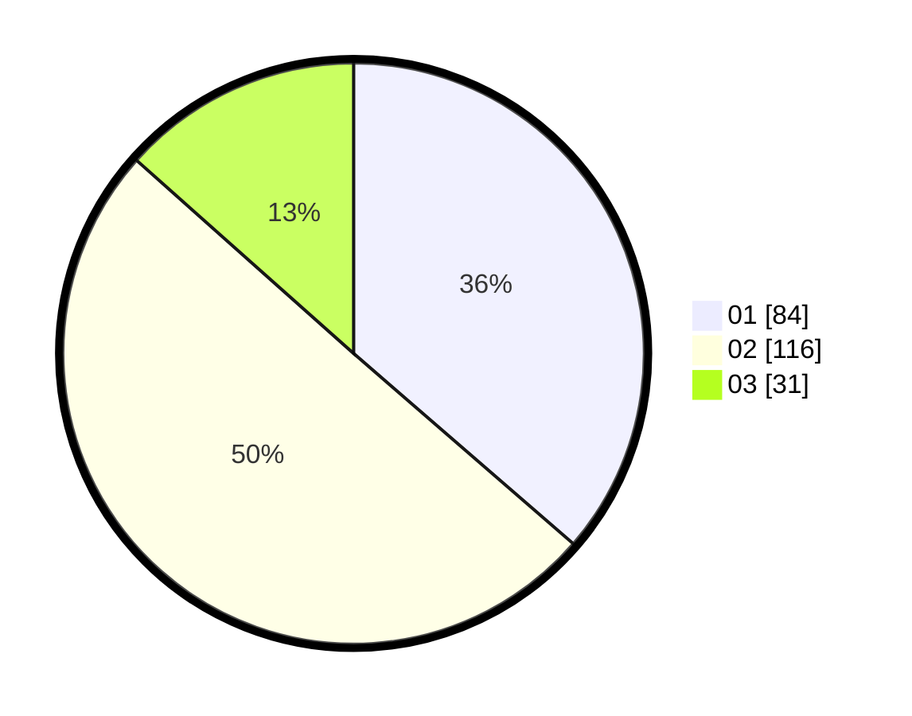

# Hasil

Hasil perolehan suara paslon dapat dilihat pada file paslon-01.txt, paslon-02.txt, dan paslon-03.txt.

Jika tidak ada, artinya data tersebut belum ada pada SIREKAP.

## Perolehan Suara

 * Paslon 01: **84**.
 * Paslon 02: **116**.
 * Paslon 03: **31**.

## Foto C Plano

https://sirekap-obj-formc.kpu.go.id/0d00/pemilu/ppwp/31/75/10/10/07/3175101007050-20240214-193213--3df7a80e-e316-4631-b484-56ef397e4ac1.jpg

https://sirekap-obj-formc.kpu.go.id/0d00/pemilu/ppwp/31/75/10/10/07/3175101007050-20240214-193219--abdf37c8-3472-4fbf-ac94-41e9af13a5c7.jpg

https://sirekap-obj-formc.kpu.go.id/0d00/pemilu/ppwp/31/75/10/10/07/3175101007050-20240214-193224--7a9b35e6-7020-4ff0-b919-55bdc7c78530.jpg

## DATA PEMILIH TETAP

Jumlah pemilih dalam DPT: **271**.
 * L: **139**.
 * P: **132**.

## DATA PENGGUNA HAK PILIH

Jumlah pengguna hak pilih dalam DPT: **226**.
 * L: **119**.
 * P: **107**.

Jumlah pengguna hak pilih dalam DPTb: **0**.
 * L: **0**.
 * P: **0**.

Jumlah pengguna hak pilih dalam DPK: **7**.
 * L: **3**.
 * P: **4**.

Jumlah pengguna hak pilih: **233**.
 * L: **122**.
 * P: **111**.

## JUMLAH SUARA SAH DAN TIDAK SAH

JUMLAH SELURUH SUARA SAH: **231**.

JUMLAH SUARA TIDAK SAH: **2**.

JUMLAH SELURUH SUARA SAH DAN SUARA TIDAK SAH: **233**.
