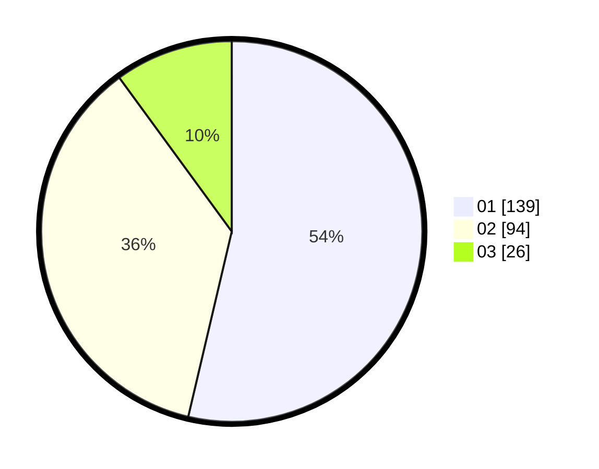

# Hasil

Hasil perolehan suara paslon dapat dilihat pada file paslon-01.txt, paslon-02.txt, dan paslon-03.txt.

Jika tidak ada, artinya data tersebut belum ada pada SIREKAP.

## Perolehan Suara

 * Paslon 01: **139**.
 * Paslon 02: **94**.
 * Paslon 03: **26**.

## Foto C Plano

https://sirekap-obj-formc.kpu.go.id/794b/pemilu/ppwp/31/75/10/10/07/3175101007065-20240215-010152--188d9bf7-dd74-4e09-b5c4-b562ef85dcba.jpg

https://sirekap-obj-formc.kpu.go.id/794b/pemilu/ppwp/31/75/10/10/07/3175101007065-20240215-010213--9d22ed70-9b96-425a-85ad-6b65eefeba21.jpg

https://sirekap-obj-formc.kpu.go.id/794b/pemilu/ppwp/31/75/10/10/07/3175101007065-20240215-010202--f7375834-68a0-4240-abce-5c166d43350b.jpg

## DATA PEMILIH TETAP

Jumlah pemilih dalam DPT: **287**.
 * L: **147**.
 * P: **140**.

## DATA PENGGUNA HAK PILIH

Jumlah pengguna hak pilih dalam DPT: **259**.
 * L: **136**.
 * P: **123**.

Jumlah pengguna hak pilih dalam DPTb: **1**.
 * L: **1**.
 * P: **0**.

Jumlah pengguna hak pilih dalam DPK: **2**.
 * L: **1**.
 * P: **1**.

Jumlah pengguna hak pilih: **262**.
 * L: **138**.
 * P: **124**.

## JUMLAH SUARA SAH DAN TIDAK SAH

JUMLAH SELURUH SUARA SAH: **259**.

JUMLAH SUARA TIDAK SAH: **3**.

JUMLAH SELURUH SUARA SAH DAN SUARA TIDAK SAH: **262**.
