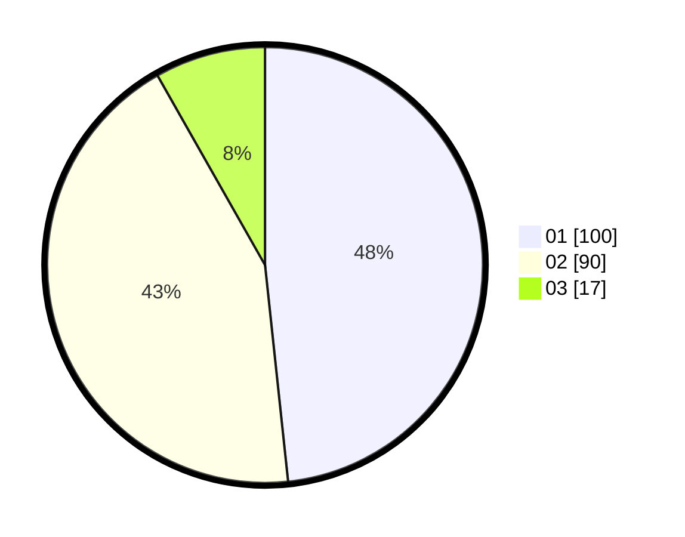

# Hasil

Hasil perolehan suara paslon dapat dilihat pada file paslon-01.txt, paslon-02.txt, dan paslon-03.txt.

Jika tidak ada, artinya data tersebut belum ada pada SIREKAP.

## Perolehan Suara

 * Paslon 01: **100**.
 * Paslon 02: **90**.
 * Paslon 03: **17**.

## Foto C Plano

https://sirekap-obj-formc.kpu.go.id/7892/pemilu/ppwp/31/75/10/10/07/3175101007067-20240214-191922--25f4e088-840b-46eb-aceb-12bd9137db08.jpg

https://sirekap-obj-formc.kpu.go.id/7892/pemilu/ppwp/31/75/10/10/07/3175101007067-20240214-191919--39ab5d7e-9928-41ec-adc0-8eceb15688d1.jpg

https://sirekap-obj-formc.kpu.go.id/7892/pemilu/ppwp/31/75/10/10/07/3175101007067-20240214-191916--3849c2b2-f7fc-480b-b399-517db324ca5a.jpg
