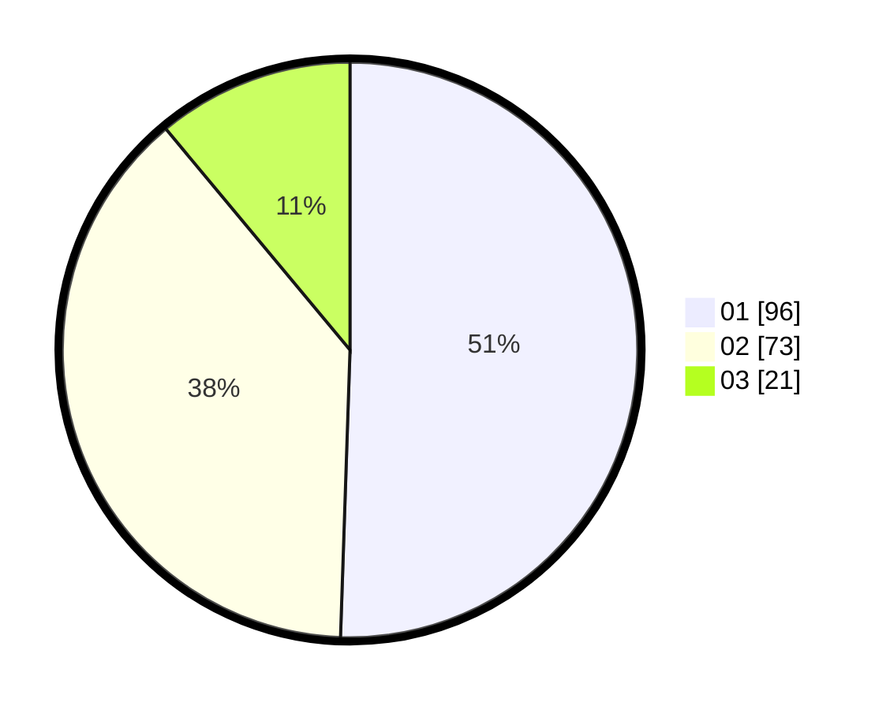

# Hasil

Hasil perolehan suara paslon dapat dilihat pada file paslon-01.txt, paslon-02.txt, dan paslon-03.txt.

Jika tidak ada, artinya data tersebut belum ada pada SIREKAP.

## Perolehan Suara

 * Paslon 01: **96**.
 * Paslon 02: **73**.
 * Paslon 03: **21**.

## Foto C Plano

https://sirekap-obj-formc.kpu.go.id/fbcc/pemilu/ppwp/31/75/10/10/07/3175101007083-20240215-231018--f4b62f7b-4a5a-4bb2-a9b4-a33be534e616.jpg

https://sirekap-obj-formc.kpu.go.id/fbcc/pemilu/ppwp/31/75/10/10/07/3175101007083-20240215-231021--734b0549-515d-4d2c-ac99-ca747417669a.jpg

https://sirekap-obj-formc.kpu.go.id/fbcc/pemilu/ppwp/31/75/10/10/07/3175101007083-20240215-231020--7effa827-3959-46cd-8038-6188d83b3af1.jpg

## DATA PEMILIH TETAP

Jumlah pemilih dalam DPT: **255**.
 * L: **138**.
 * P: **117**.

## DATA PENGGUNA HAK PILIH

Jumlah pengguna hak pilih dalam DPT: **197**.
 * L: **102**.
 * P: **95**.

Jumlah pengguna hak pilih dalam DPTb: **1**.
 * L: **1**.
 * P: **0**.

Jumlah pengguna hak pilih dalam DPK: **0**.
 * L: **0**.
 * P: **0**.

Jumlah pengguna hak pilih: **198**.
 * L: **103**.
 * P: **95**.

## JUMLAH SUARA SAH DAN TIDAK SAH

JUMLAH SELURUH SUARA SAH: **190**.

JUMLAH SUARA TIDAK SAH: **8**.

JUMLAH SELURUH SUARA SAH DAN SUARA TIDAK SAH: **198**.
