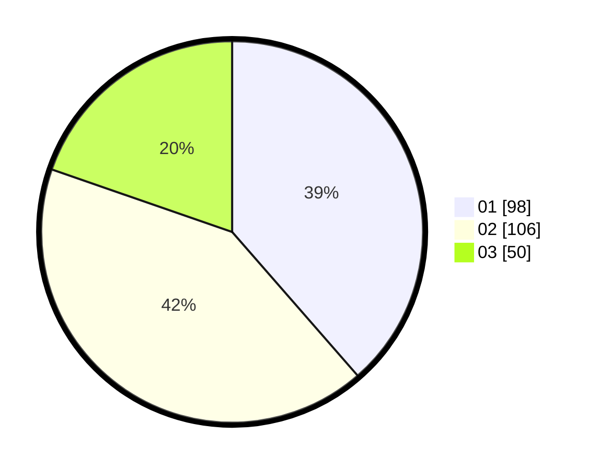

# Hasil

Hasil perolehan suara paslon dapat dilihat pada file paslon-01.txt, paslon-02.txt, dan paslon-03.txt.

Jika tidak ada, artinya data tersebut belum ada pada SIREKAP.

## Perolehan Suara

 * Paslon 01: **98**.
 * Paslon 02: **106**.
 * Paslon 03: **50**.

## Foto C Plano

https://sirekap-obj-formc.kpu.go.id/52ff/pemilu/ppwp/31/75/10/10/07/3175101007087-20240216-134201--a3d199f5-1ec4-4d11-955f-ad42dee281c2.jpg

https://sirekap-obj-formc.kpu.go.id/52ff/pemilu/ppwp/31/75/10/10/07/3175101007087-20240216-134426--315d58c2-04f1-48af-9e4c-f2406f6b4fd5.jpg

https://sirekap-obj-formc.kpu.go.id/52ff/pemilu/ppwp/31/75/10/10/07/3175101007087-20240216-134449--8eddaf9c-63d5-4cea-a003-3f922a332626.jpg
