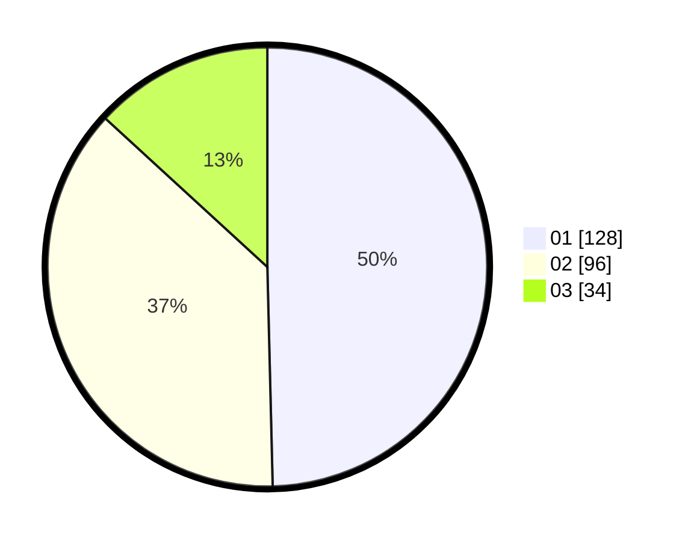

# Hasil

Hasil perolehan suara paslon dapat dilihat pada file paslon-01.txt, paslon-02.txt, dan paslon-03.txt.

Jika tidak ada, artinya data tersebut belum ada pada SIREKAP.

## Perolehan Suara

 * Paslon 01: **128**.
 * Paslon 02: **96**.
 * Paslon 03: **34**.

## Foto C Plano

https://sirekap-obj-formc.kpu.go.id/777c/pemilu/ppwp/31/75/10/10/07/3175101007088-20240215-021949--da56c99e-5ac1-4cdb-b28c-aaf1c4f31f6c.jpg

https://sirekap-obj-formc.kpu.go.id/777c/pemilu/ppwp/31/75/10/10/07/3175101007088-20240215-021715--b04242f5-9334-4d7f-8e28-2fec5cd5bc0d.jpg

https://sirekap-obj-formc.kpu.go.id/777c/pemilu/ppwp/31/75/10/10/07/3175101007088-20240215-022128--8351bdc3-15b0-418d-9442-f77bdeded943.jpg
