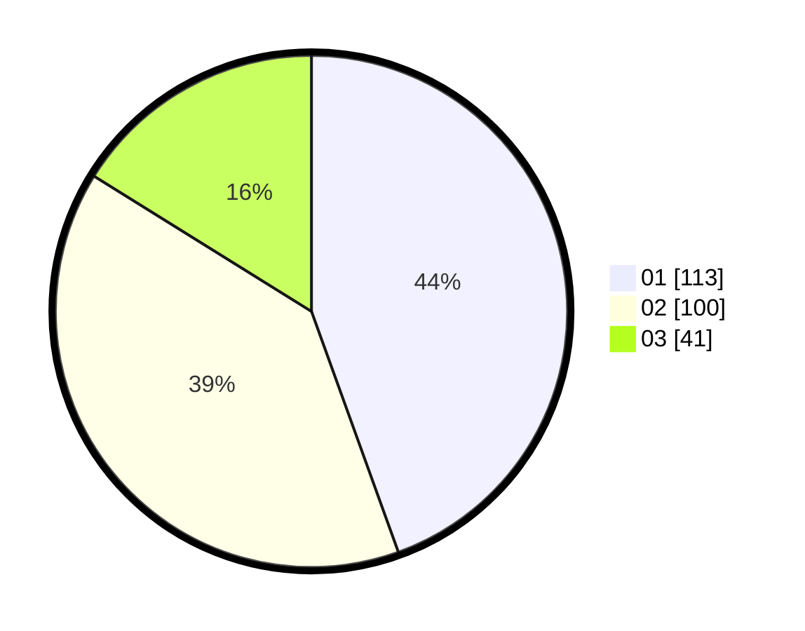

# Hasil

Hasil perolehan suara paslon dapat dilihat pada file paslon-01.txt, paslon-02.txt, dan paslon-03.txt.

Jika tidak ada, artinya data tersebut belum ada pada SIREKAP.

## Perolehan Suara

 * Paslon 01: **113**.
 * Paslon 02: **100**.
 * Paslon 03: **41**.

## Foto C Plano

https://sirekap-obj-formc.kpu.go.id/c771/pemilu/ppwp/31/75/10/10/07/3175101007090-20240216-132045--21a5e4e9-a048-4fc8-9c96-65cb642f731a.jpg

https://sirekap-obj-formc.kpu.go.id/c771/pemilu/ppwp/31/75/10/10/07/3175101007090-20240216-132046--ea04d1e3-49b7-4083-8c0e-87e0dbae507f.jpg

https://sirekap-obj-formc.kpu.go.id/c771/pemilu/ppwp/31/75/10/10/07/3175101007090-20240216-132045--309fac66-f071-4761-964d-bdc14b23efbd.jpg

## DATA PEMILIH TETAP

Jumlah pemilih dalam DPT: **291**.
 * L: **148**.
 * P: **143**.

## DATA PENGGUNA HAK PILIH

Jumlah pengguna hak pilih dalam DPT: **250**.
 * L: **126**.
 * P: **124**.

Jumlah pengguna hak pilih dalam DPTb: **5**.
 * L: **3**.
 * P: **2**.

Jumlah pengguna hak pilih dalam DPK: **4**.
 * L: **1**.
 * P: **3**.

Jumlah pengguna hak pilih: **259**.
 * L: **130**.
 * P: **129**.

## JUMLAH SUARA SAH DAN TIDAK SAH

JUMLAH SELURUH SUARA SAH: **254**.

JUMLAH SUARA TIDAK SAH: **5**.

JUMLAH SELURUH SUARA SAH DAN SUARA TIDAK SAH: **259**.
