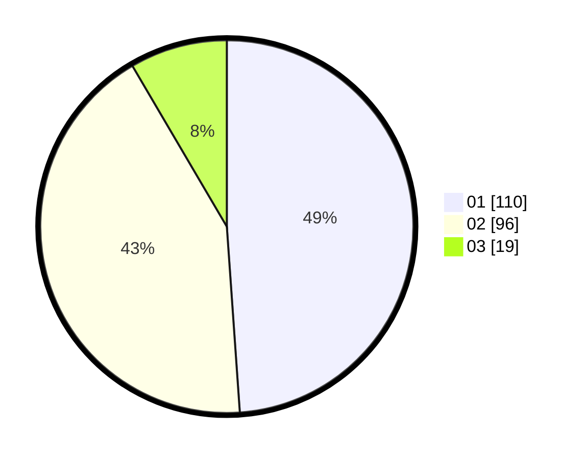

# Hasil

Hasil perolehan suara paslon dapat dilihat pada file paslon-01.txt, paslon-02.txt, dan paslon-03.txt.

Jika tidak ada, artinya data tersebut belum ada pada SIREKAP.

## Perolehan Suara

 * Paslon 01: **110**.
 * Paslon 02: **96**.
 * Paslon 03: **19**.

## Foto C Plano

https://sirekap-obj-formc.kpu.go.id/f393/pemilu/ppwp/31/75/10/10/07/3175101007091-20240215-005839--296e545f-176c-4f63-b63b-34053cebd976.jpg

https://sirekap-obj-formc.kpu.go.id/f393/pemilu/ppwp/31/75/10/10/07/3175101007091-20240215-010438--f6f9fb14-0964-499d-8990-20232d1f55a4.jpg

https://sirekap-obj-formc.kpu.go.id/f393/pemilu/ppwp/31/75/10/10/07/3175101007091-20240215-010513--c45d4cf9-bca2-4368-bbfa-916ef8a96b2d.jpg
