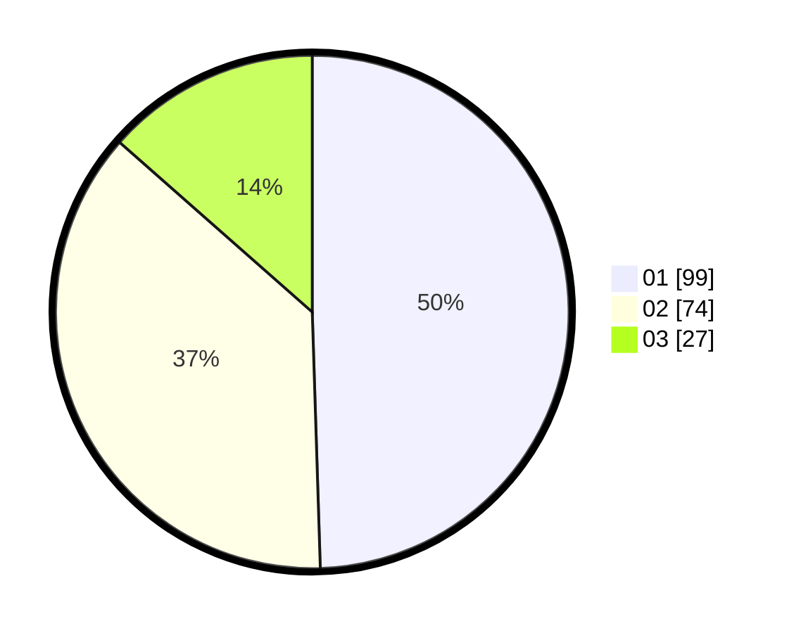

# Hasil

Hasil perolehan suara paslon dapat dilihat pada file paslon-01.txt, paslon-02.txt, dan paslon-03.txt.

Jika tidak ada, artinya data tersebut belum ada pada SIREKAP.

## Perolehan Suara

 * Paslon 01: **99**.
 * Paslon 02: **74**.
 * Paslon 03: **27**.

## Foto C Plano

https://sirekap-obj-formc.kpu.go.id/7491/pemilu/ppwp/31/75/10/10/07/3175101007103-20240216-210231--bf5e3925-476a-4201-bb93-3daf35b4b7b7.jpg

https://sirekap-obj-formc.kpu.go.id/7491/pemilu/ppwp/31/75/10/10/07/3175101007103-20240216-205734--c644a2b1-549c-40d8-85b6-3b60fd8aa2a1.jpg

https://sirekap-obj-formc.kpu.go.id/7491/pemilu/ppwp/31/75/10/10/07/3175101007103-20240216-205425--01233ff6-23ed-4583-b4fb-755d471ac600.jpg

## DATA PEMILIH TETAP

Jumlah pemilih dalam DPT: **262**.
 * L: **128**.
 * P: **134**.

## DATA PENGGUNA HAK PILIH

Jumlah pengguna hak pilih dalam DPT: **199**.
 * L: **90**.
 * P: **109**.

Jumlah pengguna hak pilih dalam DPTb: **1**.
 * L: **1**.
 * P: **0**.

Jumlah pengguna hak pilih dalam DPK: **3**.
 * L: **1**.
 * P: **2**.

Jumlah pengguna hak pilih: **203**.
 * L: **92**.
 * P: **111**.

## JUMLAH SUARA SAH DAN TIDAK SAH

JUMLAH SELURUH SUARA SAH: **200**.

JUMLAH SUARA TIDAK SAH: **3**.

JUMLAH SELURUH SUARA SAH DAN SUARA TIDAK SAH: **203**.
