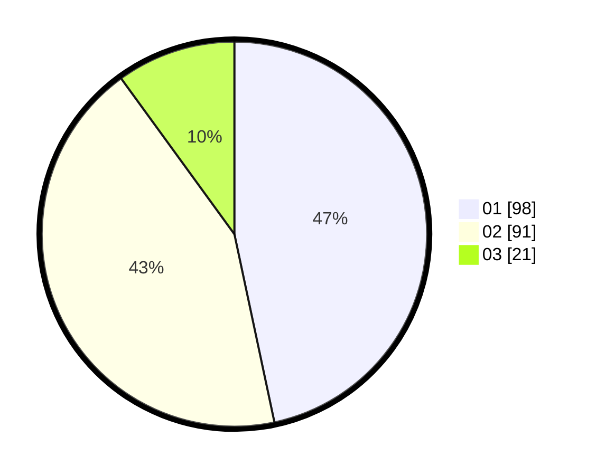

# Hasil

Hasil perolehan suara paslon dapat dilihat pada file paslon-01.txt, paslon-02.txt, dan paslon-03.txt.

Jika tidak ada, artinya data tersebut belum ada pada SIREKAP.

## Perolehan Suara

 * Paslon 01: **98**.
 * Paslon 02: **91**.
 * Paslon 03: **21**.

## Foto C Plano

https://sirekap-obj-formc.kpu.go.id/9736/pemilu/ppwp/31/75/10/10/07/3175101007106-20240214-185658--b339deaf-0333-48f8-8aab-06254c0dd0a7.jpg

https://sirekap-obj-formc.kpu.go.id/9736/pemilu/ppwp/31/75/10/10/07/3175101007106-20240214-200722--780459b4-8de0-44ba-930d-3eec019fb71a.jpg

https://sirekap-obj-formc.kpu.go.id/9736/pemilu/ppwp/31/75/10/10/07/3175101007106-20240215-211307--1bd21639-2c26-4ad8-abbe-efbf88a1c7dd.jpg

## DATA PEMILIH TETAP

Jumlah pemilih dalam DPT: **268**.
 * L: **111**.
 * P: **147**.

## DATA PENGGUNA HAK PILIH

Jumlah pengguna hak pilih dalam DPT: **210**.
 * L: **88**.
 * P: **122**.

Jumlah pengguna hak pilih dalam DPTb: **0**.
 * L: **0**.
 * P: **0**.

Jumlah pengguna hak pilih dalam DPK: **3**.
 * L: **1**.
 * P: **2**.

Jumlah pengguna hak pilih: **213**.
 * L: **89**.
 * P: **624**.

## JUMLAH SUARA SAH DAN TIDAK SAH

JUMLAH SELURUH SUARA SAH: **210**.

JUMLAH SUARA TIDAK SAH: **3**.

JUMLAH SELURUH SUARA SAH DAN SUARA TIDAK SAH: **213**.
