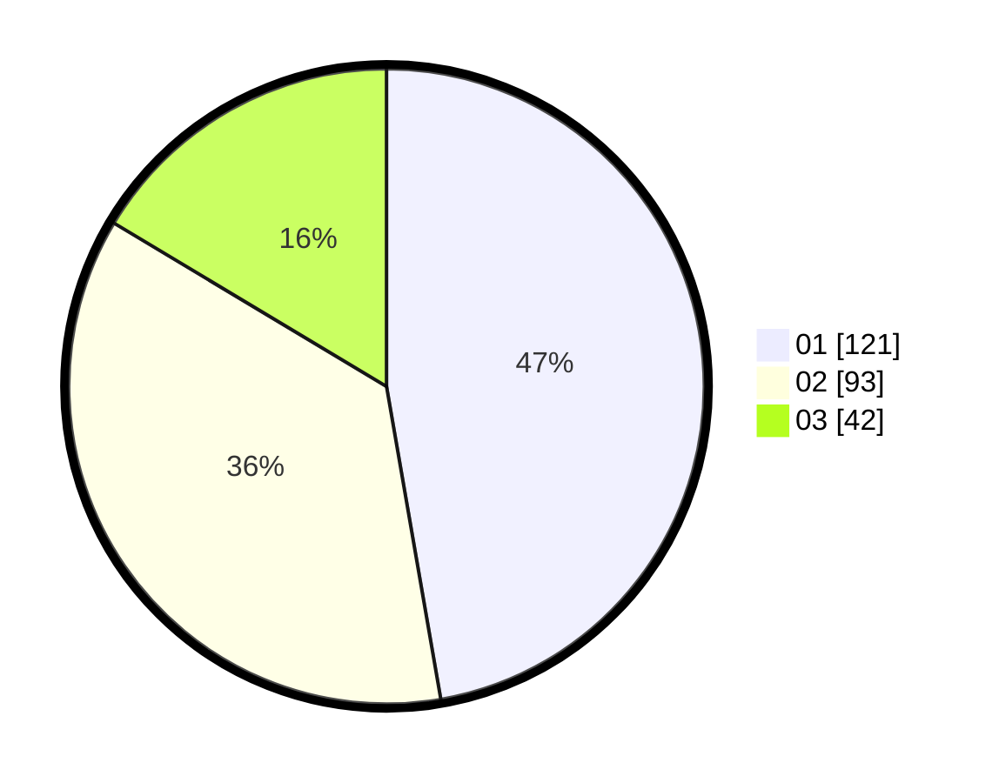

# Hasil

Hasil perolehan suara paslon dapat dilihat pada file paslon-01.txt, paslon-02.txt, dan paslon-03.txt.

Jika tidak ada, artinya data tersebut belum ada pada SIREKAP.

## Perolehan Suara

 * Paslon 01: **121**.
 * Paslon 02: **93**.
 * Paslon 03: **42**.

## Foto C Plano

https://sirekap-obj-formc.kpu.go.id/776c/pemilu/ppwp/31/75/10/10/07/3175101007109-20240215-231938--a37a5924-ca69-48f1-97eb-68e8b4b6c170.jpg

https://sirekap-obj-formc.kpu.go.id/776c/pemilu/ppwp/31/75/10/10/07/3175101007109-20240215-231941--7f177d8e-5bc9-45ff-a5e0-27e2443a0c4a.jpg

https://sirekap-obj-formc.kpu.go.id/776c/pemilu/ppwp/31/75/10/10/07/3175101007109-20240215-231940--1c1504e9-f852-4a8e-abb1-2727e55164fb.jpg

## DATA PEMILIH TETAP

Jumlah pemilih dalam DPT: **287**.
 * L: **145**.
 * P: **142**.

## DATA PENGGUNA HAK PILIH

Jumlah pengguna hak pilih dalam DPT: **249**.
 * L: **126**.
 * P: **123**.

Jumlah pengguna hak pilih dalam DPTb: **0**.
 * L: **0**.
 * P: **0**.

Jumlah pengguna hak pilih dalam DPK: **8**.
 * L: **4**.
 * P: **4**.

Jumlah pengguna hak pilih: **257**.
 * L: **130**.
 * P: **127**.

## JUMLAH SUARA SAH DAN TIDAK SAH

JUMLAH SELURUH SUARA SAH: **256**.

JUMLAH SUARA TIDAK SAH: **1**.

JUMLAH SELURUH SUARA SAH DAN SUARA TIDAK SAH: **257**.
