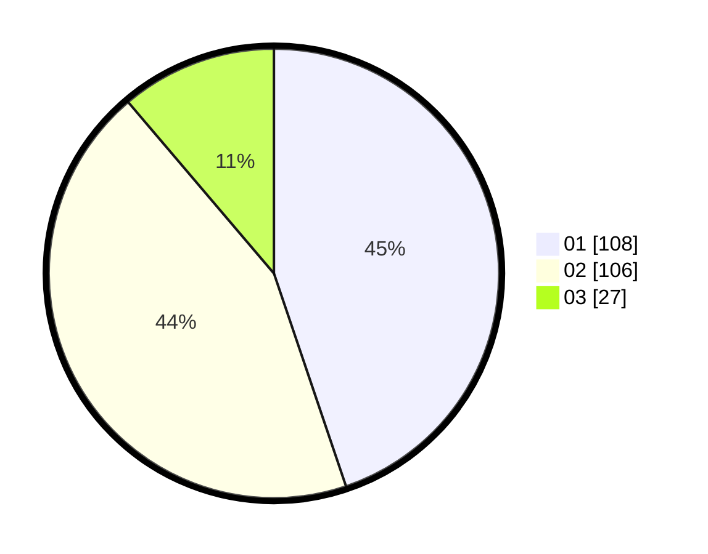

# Hasil

Hasil perolehan suara paslon dapat dilihat pada file paslon-01.txt, paslon-02.txt, dan paslon-03.txt.

Jika tidak ada, artinya data tersebut belum ada pada SIREKAP.

## Perolehan Suara

 * Paslon 01: **108**.
 * Paslon 02: **106**.
 * Paslon 03: **27**.

## Foto C Plano

https://sirekap-obj-formc.kpu.go.id/6a32/pemilu/ppwp/31/75/10/10/07/3175101007111-20240216-161950--4d77589d-a8f8-454a-8f55-d252822c2c19.jpg

https://sirekap-obj-formc.kpu.go.id/6a32/pemilu/ppwp/31/75/10/10/07/3175101007111-20240214-155625--82497b3a-f321-4bee-9b3a-0516bddf0dbe.jpg

https://sirekap-obj-formc.kpu.go.id/6a32/pemilu/ppwp/31/75/10/10/07/3175101007111-20240214-155809--879eb771-de6e-4c4c-9322-774f18cc3c7f.jpg

## DATA PEMILIH TETAP

Jumlah pemilih dalam DPT: **287**.
 * L: **140**.
 * P: **147**.

## DATA PENGGUNA HAK PILIH

Jumlah pengguna hak pilih dalam DPT: **237**.
 * L: **111**.
 * P: **126**.

Jumlah pengguna hak pilih dalam DPTb: **2**.
 * L: **1**.
 * P: **1**.

Jumlah pengguna hak pilih dalam DPK: **2**.
 * L: **2**.
 * P: **0**.

Jumlah pengguna hak pilih: **241**.
 * L: **114**.
 * P: **127**.

## JUMLAH SUARA SAH DAN TIDAK SAH

JUMLAH SELURUH SUARA SAH: **241**.

JUMLAH SUARA TIDAK SAH: **0**.

JUMLAH SELURUH SUARA SAH DAN SUARA TIDAK SAH: **241**.
