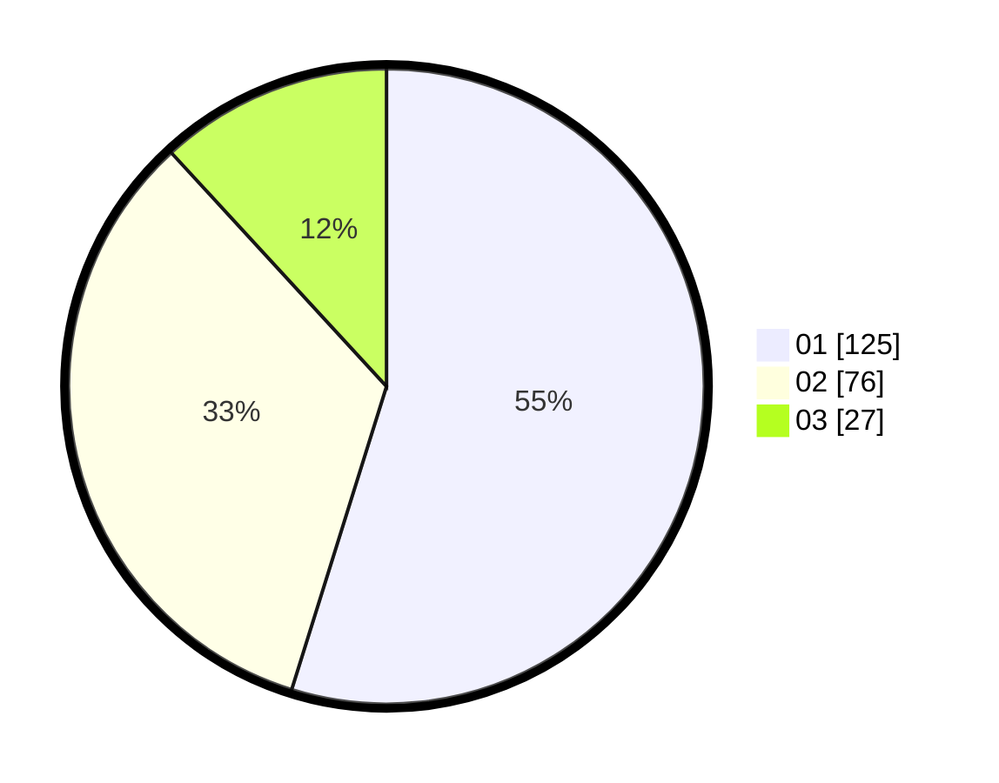

# Hasil

Hasil perolehan suara paslon dapat dilihat pada file paslon-01.txt, paslon-02.txt, dan paslon-03.txt.

Jika tidak ada, artinya data tersebut belum ada pada SIREKAP.

## Perolehan Suara

 * Paslon 01: **125**.
 * Paslon 02: **76**.
 * Paslon 03: **27**.

## Foto C Plano

https://sirekap-obj-formc.kpu.go.id/629d/pemilu/ppwp/31/75/10/10/07/3175101007117-20240215-211847--2bcec472-fa6d-49c0-b7cf-adbacd43b5a0.jpg

https://sirekap-obj-formc.kpu.go.id/629d/pemilu/ppwp/31/75/10/10/07/3175101007117-20240215-212045--c91d5804-3fca-4dfb-93d5-38d260718412.jpg

https://sirekap-obj-formc.kpu.go.id/629d/pemilu/ppwp/31/75/10/10/07/3175101007117-20240215-213141--f9d845df-82e6-4e47-a840-9ea2c7ed4c66.jpg

## DATA PEMILIH TETAP

Jumlah pemilih dalam DPT: **279**.
 * L: **140**.
 * P: **139**.

## DATA PENGGUNA HAK PILIH

Jumlah pengguna hak pilih dalam DPT: **229**.
 * L: **110**.
 * P: **119**.

Jumlah pengguna hak pilih dalam DPTb: **0**.
 * L: **0**.
 * P: **0**.

Jumlah pengguna hak pilih dalam DPK: **0**.
 * L: **0**.
 * P: **0**.

Jumlah pengguna hak pilih: **229**.
 * L: **110**.
 * P: **119**.

## JUMLAH SUARA SAH DAN TIDAK SAH

JUMLAH SELURUH SUARA SAH: **228**.

JUMLAH SUARA TIDAK SAH: **1**.

JUMLAH SELURUH SUARA SAH DAN SUARA TIDAK SAH: **229**.
