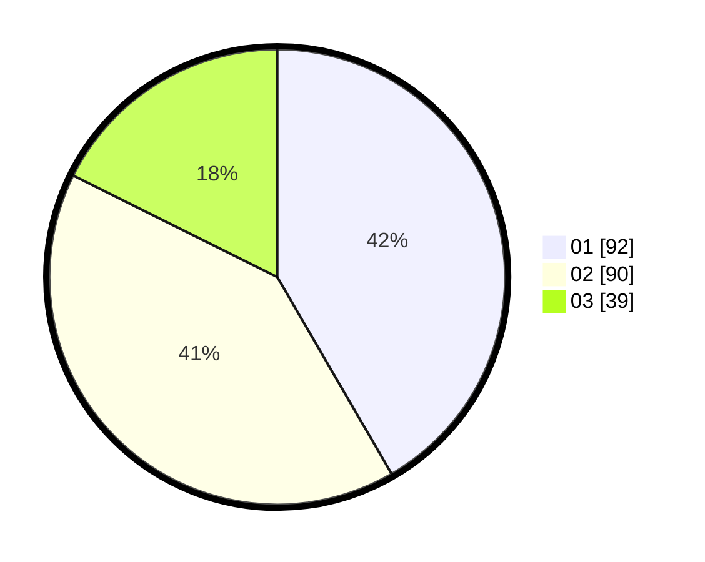

# Hasil

Hasil perolehan suara paslon dapat dilihat pada file paslon-01.txt, paslon-02.txt, dan paslon-03.txt.

Jika tidak ada, artinya data tersebut belum ada pada SIREKAP.

## Perolehan Suara

 * Paslon 01: **92**.
 * Paslon 02: **90**.
 * Paslon 03: **39**.

## Foto C Plano

https://sirekap-obj-formc.kpu.go.id/c79b/pemilu/ppwp/31/75/10/10/07/3175101007123-20240216-233054--bb565c78-1840-4cdd-82b6-0a17be998604.jpg

https://sirekap-obj-formc.kpu.go.id/c79b/pemilu/ppwp/31/75/10/10/07/3175101007123-20240216-233056--b6a585de-429e-40b9-b7b4-c0bfa72094ce.jpg

https://sirekap-obj-formc.kpu.go.id/c79b/pemilu/ppwp/31/75/10/10/07/3175101007123-20240216-233055--1d908167-4d60-4327-a3f1-893b0ba050c3.jpg

## DATA PEMILIH TETAP

Jumlah pemilih dalam DPT: **257**.
 * L: **137**.
 * P: **120**.

## DATA PENGGUNA HAK PILIH

Jumlah pengguna hak pilih dalam DPT: **223**.
 * L: **118**.
 * P: **105**.

Jumlah pengguna hak pilih dalam DPTb: **0**.
 * L: **0**.
 * P: **0**.

Jumlah pengguna hak pilih dalam DPK: **4**.
 * L: **3**.
 * P: **1**.

Jumlah pengguna hak pilih: **227**.
 * L: **121**.
 * P: **106**.

## JUMLAH SUARA SAH DAN TIDAK SAH

JUMLAH SELURUH SUARA SAH: **221**.

JUMLAH SUARA TIDAK SAH: **6**.

JUMLAH SELURUH SUARA SAH DAN SUARA TIDAK SAH: **227**.
