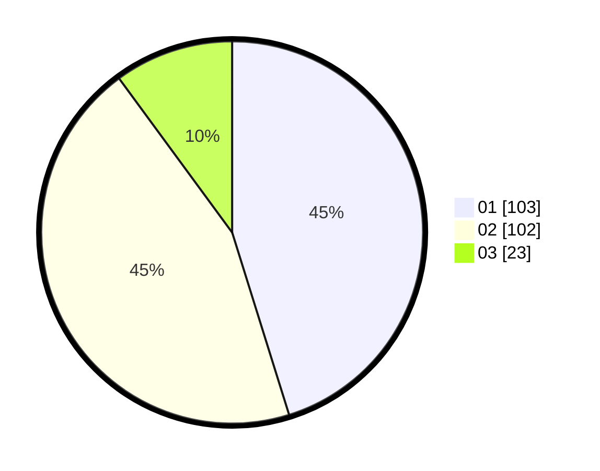

# Hasil

Hasil perolehan suara paslon dapat dilihat pada file paslon-01.txt, paslon-02.txt, dan paslon-03.txt.

Jika tidak ada, artinya data tersebut belum ada pada SIREKAP.

## Perolehan Suara

 * Paslon 01: **103**.
 * Paslon 02: **102**.
 * Paslon 03: **23**.

## Foto C Plano

https://sirekap-obj-formc.kpu.go.id/9a50/pemilu/ppwp/31/75/10/10/07/3175101007126-20240216-132718--4062a3f3-b850-4d29-bbcb-41ad59e10203.jpg

https://sirekap-obj-formc.kpu.go.id/9a50/pemilu/ppwp/31/75/10/10/07/3175101007126-20240216-132719--97bb43f5-7bda-482c-9949-a3630380dbe2.jpg

https://sirekap-obj-formc.kpu.go.id/9a50/pemilu/ppwp/31/75/10/10/07/3175101007126-20240216-132718--4d4fe112-a465-44e7-b119-16239c8f0f1d.jpg

## DATA PEMILIH TETAP

Jumlah pemilih dalam DPT: **264**.
 * L: **136**.
 * P: **128**.

## DATA PENGGUNA HAK PILIH

Jumlah pengguna hak pilih dalam DPT: **221**.
 * L: **106**.
 * P: **115**.

Jumlah pengguna hak pilih dalam DPTb: **0**.
 * L: **0**.
 * P: **0**.

Jumlah pengguna hak pilih dalam DPK: **7**.
 * L: **5**.
 * P: **2**.

Jumlah pengguna hak pilih: **228**.
 * L: **111**.
 * P: **117**.

## JUMLAH SUARA SAH DAN TIDAK SAH

JUMLAH SELURUH SUARA SAH: **228**.

JUMLAH SUARA TIDAK SAH: **0**.

JUMLAH SELURUH SUARA SAH DAN SUARA TIDAK SAH: **228**.
