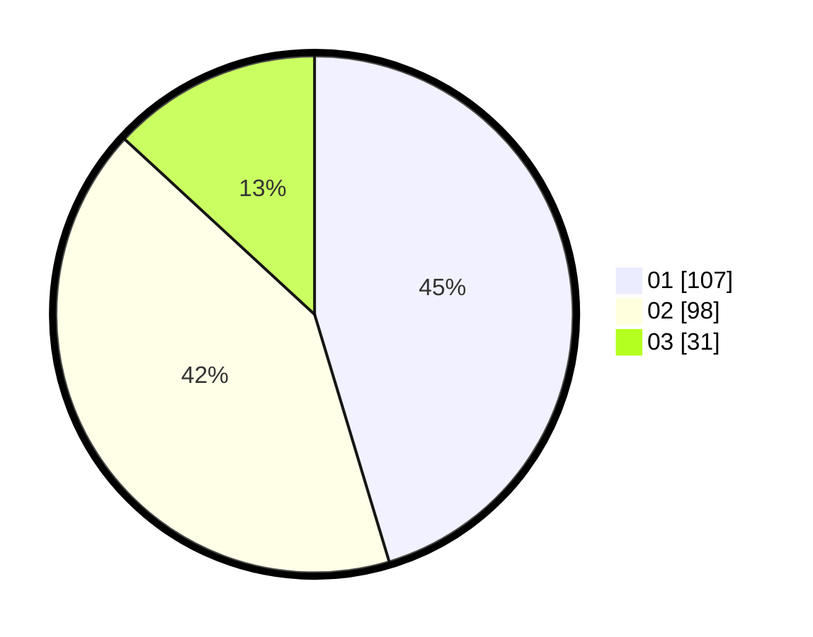

# Hasil

Hasil perolehan suara paslon dapat dilihat pada file paslon-01.txt, paslon-02.txt, dan paslon-03.txt.

Jika tidak ada, artinya data tersebut belum ada pada SIREKAP.

## Perolehan Suara

 * Paslon 01: **107**.
 * Paslon 02: **98**.
 * Paslon 03: **31**.

## Foto C Plano

https://sirekap-obj-formc.kpu.go.id/e785/pemilu/ppwp/31/75/10/10/07/3175101007153-20240215-014944--bd85fdda-434b-4a75-90e2-5e22e44f1b87.jpg

https://sirekap-obj-formc.kpu.go.id/e785/pemilu/ppwp/31/75/10/10/07/3175101007153-20240215-015005--16a39d0c-a488-47a5-bf86-00f9d80fb526.jpg

https://sirekap-obj-formc.kpu.go.id/e785/pemilu/ppwp/31/75/10/10/07/3175101007153-20240215-014955--d39bd373-a3f7-4dbf-b19c-0167d915e0b9.jpg

## DATA PEMILIH TETAP

Jumlah pemilih dalam DPT: **289**.
 * L: **136**.
 * P: **153**.

## DATA PENGGUNA HAK PILIH

Jumlah pengguna hak pilih dalam DPT: **235**.
 * L: **104**.
 * P: **131**.

Jumlah pengguna hak pilih dalam DPTb: **1**.
 * L: **0**.
 * P: **1**.

Jumlah pengguna hak pilih dalam DPK: **0**.
 * L: **0**.
 * P: **0**.

Jumlah pengguna hak pilih: **236**.
 * L: **104**.
 * P: **132**.

## JUMLAH SUARA SAH DAN TIDAK SAH

JUMLAH SELURUH SUARA SAH: **236**.

JUMLAH SUARA TIDAK SAH: **0**.

JUMLAH SELURUH SUARA SAH DAN SUARA TIDAK SAH: **236**.
