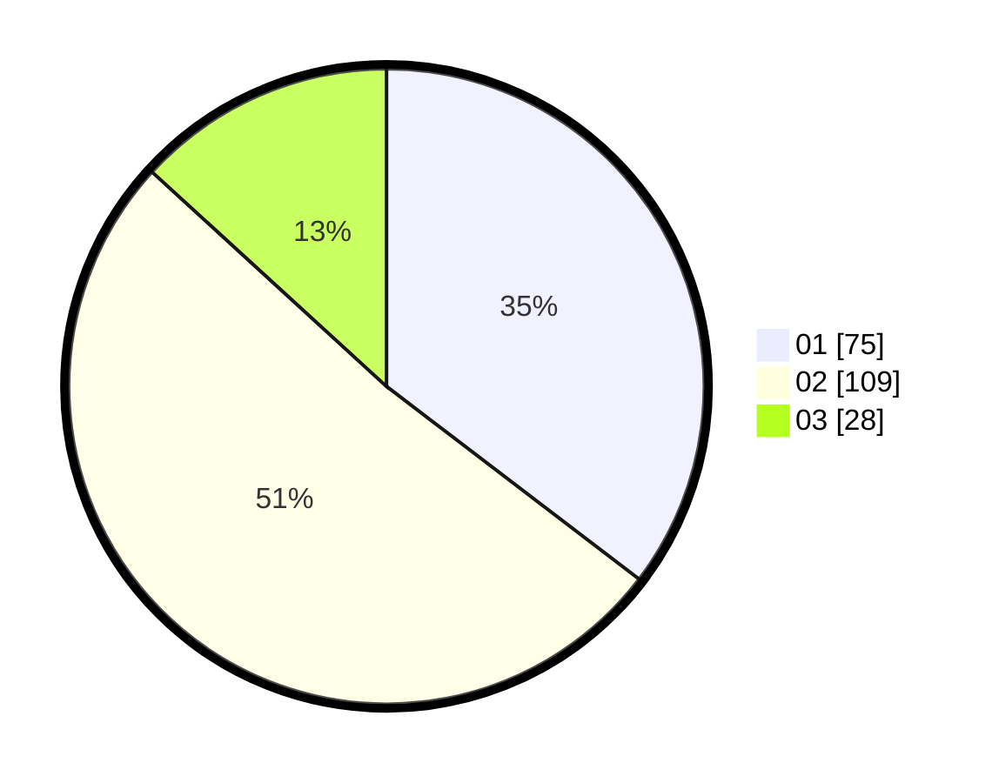

# Hasil

Hasil perolehan suara paslon dapat dilihat pada file paslon-01.txt, paslon-02.txt, dan paslon-03.txt.

Jika tidak ada, artinya data tersebut belum ada pada SIREKAP.

## Perolehan Suara

 * Paslon 01: **75**.
 * Paslon 02: **109**.
 * Paslon 03: **28**.

## Foto C Plano

https://sirekap-obj-formc.kpu.go.id/beb3/pemilu/ppwp/31/75/10/10/07/3175101007156-20240214-202527--a329fafe-ccb1-4680-9371-98d33734a54d.jpg

https://sirekap-obj-formc.kpu.go.id/beb3/pemilu/ppwp/31/75/10/10/07/3175101007156-20240214-202651--a7cc50a1-8e93-41c9-a90d-6c9256f62c8d.jpg

https://sirekap-obj-formc.kpu.go.id/beb3/pemilu/ppwp/31/75/10/10/07/3175101007156-20240215-085740--97281a7c-8143-471d-843f-21224ae1e7f6.jpg

## DATA PEMILIH TETAP

Jumlah pemilih dalam DPT: **260**.
 * L: **127**.
 * P: **133**.

## DATA PENGGUNA HAK PILIH

Jumlah pengguna hak pilih dalam DPT: **207**.
 * L: **100**.
 * P: **107**.

Jumlah pengguna hak pilih dalam DPTb: **1**.
 * L: **1**.
 * P: **0**.

Jumlah pengguna hak pilih dalam DPK: **9**.
 * L: **4**.
 * P: **5**.

Jumlah pengguna hak pilih: **217**.
 * L: **105**.
 * P: **112**.

## JUMLAH SUARA SAH DAN TIDAK SAH

JUMLAH SELURUH SUARA SAH: **212**.

JUMLAH SUARA TIDAK SAH: **5**.

JUMLAH SELURUH SUARA SAH DAN SUARA TIDAK SAH: **217**.
