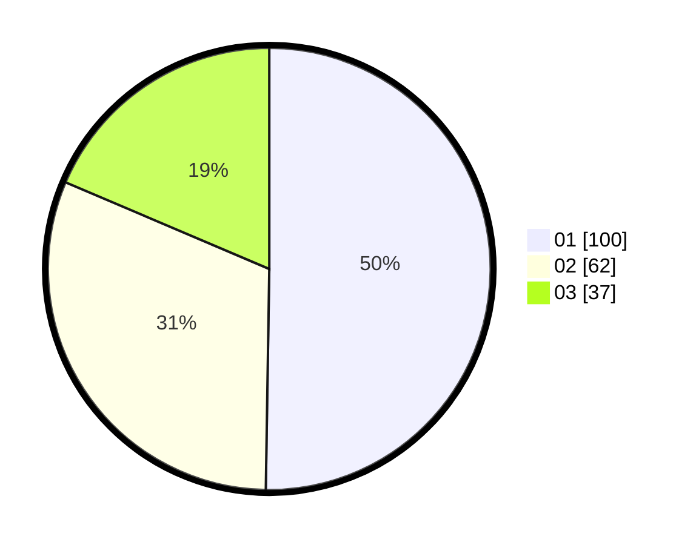

# Hasil

Hasil perolehan suara paslon dapat dilihat pada file paslon-01.txt, paslon-02.txt, dan paslon-03.txt.

Jika tidak ada, artinya data tersebut belum ada pada SIREKAP.

## Perolehan Suara

 * Paslon 01: **100**.
 * Paslon 02: **62**.
 * Paslon 03: **37**.

## Foto C Plano

https://sirekap-obj-formc.kpu.go.id/7377/pemilu/ppwp/31/75/10/10/07/3175101007160-20240214-205045--ad6ddcdc-b138-48dc-869e-429357e3ccab.jpg

https://sirekap-obj-formc.kpu.go.id/7377/pemilu/ppwp/31/75/10/10/07/3175101007160-20240214-211449--f9f4aaf5-1a55-4e69-954e-1e6c48750435.jpg

https://sirekap-obj-formc.kpu.go.id/7377/pemilu/ppwp/31/75/10/10/07/3175101007160-20240214-212045--ce28a4b4-4fff-462c-a30c-928a14fe9f43.jpg
