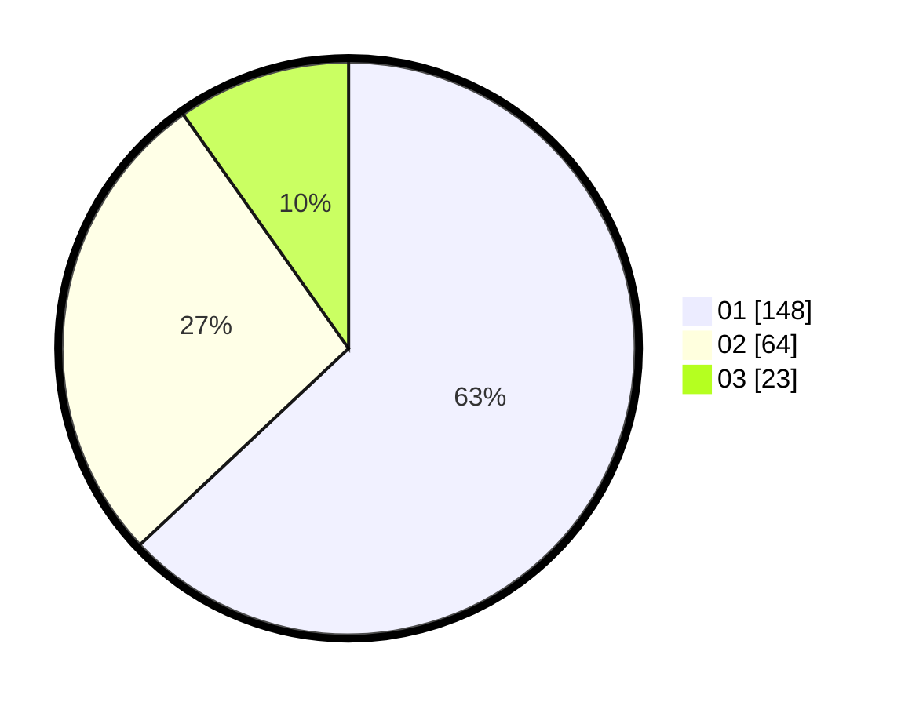

# Hasil

Hasil perolehan suara paslon dapat dilihat pada file paslon-01.txt, paslon-02.txt, dan paslon-03.txt.

Jika tidak ada, artinya data tersebut belum ada pada SIREKAP.

## Perolehan Suara

 * Paslon 01: **148**.
 * Paslon 02: **64**.
 * Paslon 03: **23**.

## Foto C Plano

https://sirekap-obj-formc.kpu.go.id/d308/pemilu/ppwp/31/75/10/10/07/3175101007164-20240214-205843--df5b7718-f08b-4dc5-ad3b-a70ea5e944d0.jpg

https://sirekap-obj-formc.kpu.go.id/d308/pemilu/ppwp/31/75/10/10/07/3175101007164-20240214-205948--6c8c19d3-9e6c-4a93-858d-41501350a6f6.jpg

https://sirekap-obj-formc.kpu.go.id/d308/pemilu/ppwp/31/75/10/10/07/3175101007164-20240214-210057--2b68e8ad-a95d-40ff-ba58-80a3f7766f9f.jpg

## DATA PEMILIH TETAP

Jumlah pemilih dalam DPT: **267**.
 * L: **130**.
 * P: **137**.

## DATA PENGGUNA HAK PILIH

Jumlah pengguna hak pilih dalam DPT: **235**.
 * L: **112**.
 * P: **113**.

Jumlah pengguna hak pilih dalam DPTb: **0**.
 * L: **0**.
 * P: **0**.

Jumlah pengguna hak pilih dalam DPK: **1**.
 * L: **0**.
 * P: **1**.

Jumlah pengguna hak pilih: **236**.
 * L: **122**.
 * P: **114**.

## JUMLAH SUARA SAH DAN TIDAK SAH

JUMLAH SELURUH SUARA SAH: **235**.

JUMLAH SUARA TIDAK SAH: **1**.

JUMLAH SELURUH SUARA SAH DAN SUARA TIDAK SAH: **1**.
