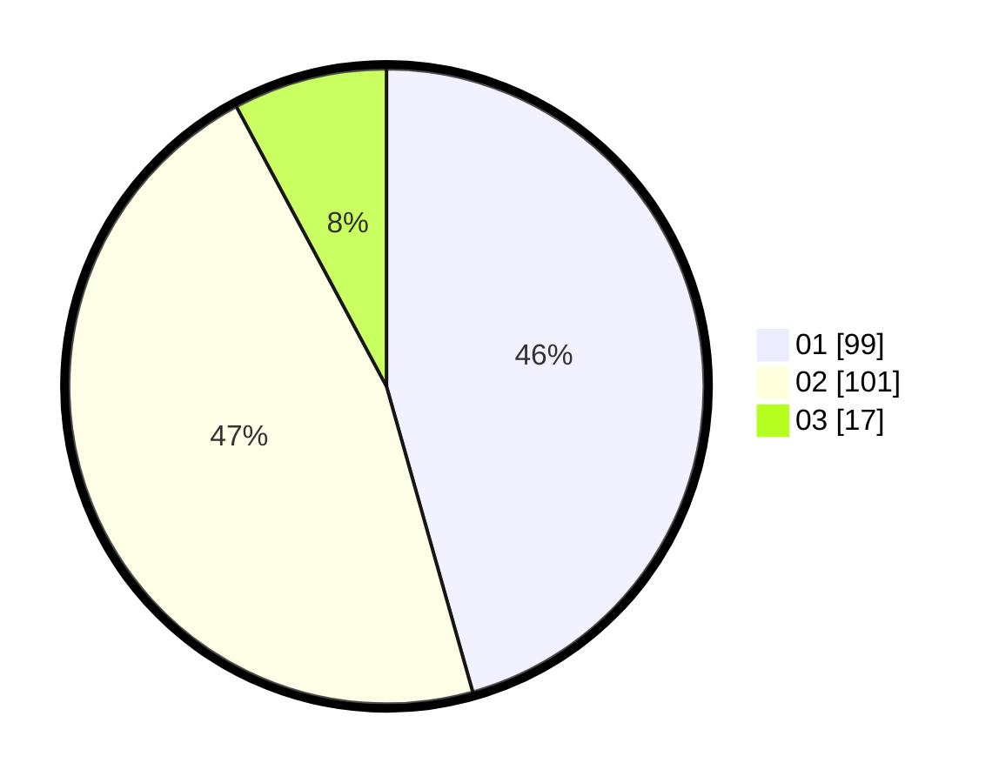

# Hasil

Hasil perolehan suara paslon dapat dilihat pada file paslon-01.txt, paslon-02.txt, dan paslon-03.txt.

Jika tidak ada, artinya data tersebut belum ada pada SIREKAP.

## Perolehan Suara

 * Paslon 01: **99**.
 * Paslon 02: **101**.
 * Paslon 03: **17**.

## Foto C Plano

https://sirekap-obj-formc.kpu.go.id/77f2/pemilu/ppwp/31/75/10/10/07/3175101007165-20240214-221056--9ea0482d-f145-4806-a42c-3e92bb910d08.jpg

https://sirekap-obj-formc.kpu.go.id/77f2/pemilu/ppwp/31/75/10/10/07/3175101007165-20240214-221235--c2fe660d-5da4-441f-b85e-9c94156accd5.jpg

https://sirekap-obj-formc.kpu.go.id/77f2/pemilu/ppwp/31/75/10/10/07/3175101007165-20240214-221344--756887bf-0639-46d7-8223-0bbf28fa7119.jpg
