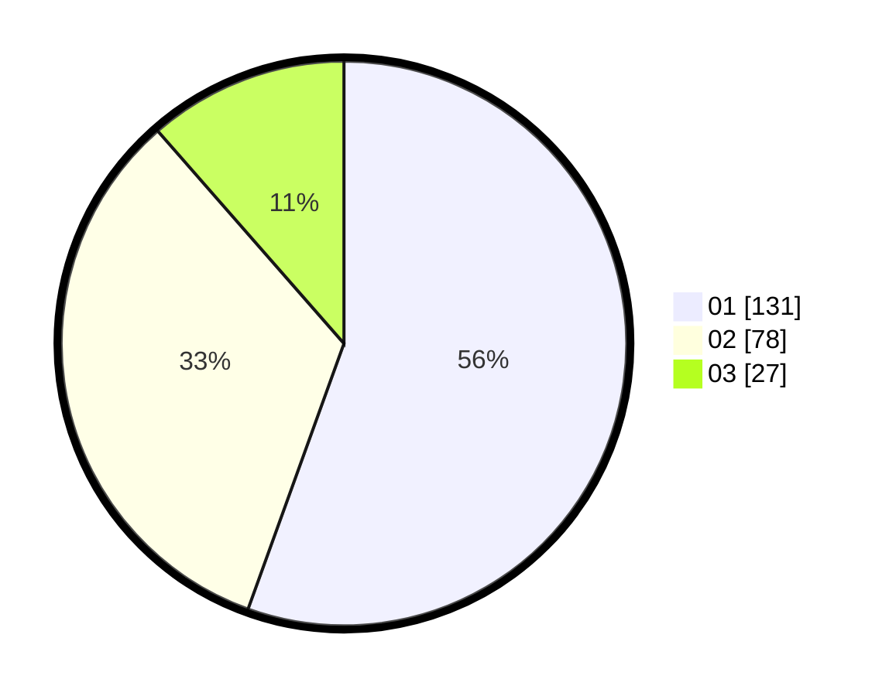

# Hasil

Hasil perolehan suara paslon dapat dilihat pada file paslon-01.txt, paslon-02.txt, dan paslon-03.txt.

Jika tidak ada, artinya data tersebut belum ada pada SIREKAP.

## Perolehan Suara

 * Paslon 01: **131**.
 * Paslon 02: **78**.
 * Paslon 03: **27**.

## Foto C Plano

https://sirekap-obj-formc.kpu.go.id/3d14/pemilu/ppwp/31/75/10/10/07/3175101007167-20240215-080004--b983c817-338a-47bc-8c0c-d24b4cf51736.jpg

https://sirekap-obj-formc.kpu.go.id/3d14/pemilu/ppwp/31/75/10/10/07/3175101007167-20240214-233939--dac12139-0371-445a-acb5-bbe3ad2f4abc.jpg

https://sirekap-obj-formc.kpu.go.id/3d14/pemilu/ppwp/31/75/10/10/07/3175101007167-20240214-234158--73cdb125-3ba6-40ba-83c3-1c399217d9d2.jpg
