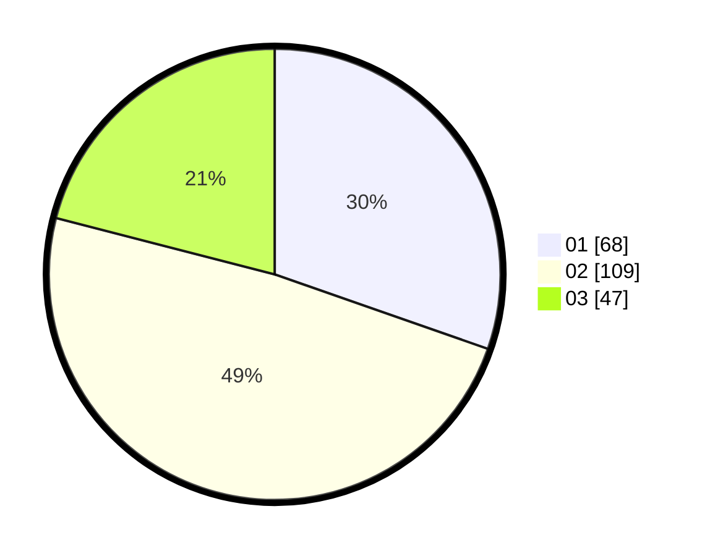

# Hasil

Hasil perolehan suara paslon dapat dilihat pada file paslon-01.txt, paslon-02.txt, dan paslon-03.txt.

Jika tidak ada, artinya data tersebut belum ada pada SIREKAP.

## Perolehan Suara

 * Paslon 01: **68**.
 * Paslon 02: **109**.
 * Paslon 03: **47**.

## Foto C Plano

https://sirekap-obj-formc.kpu.go.id/bb0f/pemilu/ppwp/31/75/10/10/07/3175101007168-20240216-130725--8ab398cd-8e16-4ee8-af9e-8fef17c80eb3.jpg

https://sirekap-obj-formc.kpu.go.id/bb0f/pemilu/ppwp/31/75/10/10/07/3175101007168-20240216-130729--41694238-511b-4cb5-8dbf-05327c0d284f.jpg

https://sirekap-obj-formc.kpu.go.id/bb0f/pemilu/ppwp/31/75/10/10/07/3175101007168-20240216-130726--c25345ea-ec7f-47f8-a3ef-e74686860d1b.jpg

## DATA PEMILIH TETAP

Jumlah pemilih dalam DPT: **291**.
 * L: **136**.
 * P: **155**.

## DATA PENGGUNA HAK PILIH

Jumlah pengguna hak pilih dalam DPT: **229**.
 * L: **104**.
 * P: **125**.

Jumlah pengguna hak pilih dalam DPTb: **0**.
 * L: **0**.
 * P: **0**.

Jumlah pengguna hak pilih dalam DPK: **0**.
 * L: **0**.
 * P: **0**.

Jumlah pengguna hak pilih: **229**.
 * L: **104**.
 * P: **125**.

## JUMLAH SUARA SAH DAN TIDAK SAH

JUMLAH SELURUH SUARA SAH: **224**.

JUMLAH SUARA TIDAK SAH: **5**.

JUMLAH SELURUH SUARA SAH DAN SUARA TIDAK SAH: **229**.
