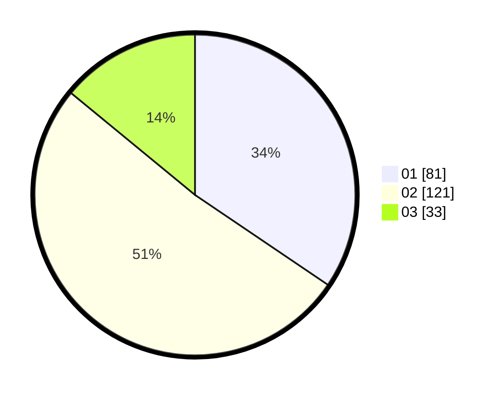

# Hasil

Hasil perolehan suara paslon dapat dilihat pada file paslon-01.txt, paslon-02.txt, dan paslon-03.txt.

Jika tidak ada, artinya data tersebut belum ada pada SIREKAP.

## Perolehan Suara

 * Paslon 01: **81**.
 * Paslon 02: **121**.
 * Paslon 03: **33**.

## Foto C Plano

https://sirekap-obj-formc.kpu.go.id/cd09/pemilu/ppwp/31/75/10/10/07/3175101007170-20240216-220718--2d2008a1-ee58-4608-89ce-20cfc66d1013.jpg

https://sirekap-obj-formc.kpu.go.id/cd09/pemilu/ppwp/31/75/10/10/07/3175101007170-20240216-220719--7b762228-0705-44ac-8c92-63218840e7d1.jpg

https://sirekap-obj-formc.kpu.go.id/cd09/pemilu/ppwp/31/75/10/10/07/3175101007170-20240216-220718--8c7bd7f2-54a3-4c82-9865-50b583f80802.jpg

## DATA PEMILIH TETAP

Jumlah pemilih dalam DPT: **274**.
 * L: **135**.
 * P: **139**.

## DATA PENGGUNA HAK PILIH

Jumlah pengguna hak pilih dalam DPT: **238**.
 * L: **114**.
 * P: **124**.

Jumlah pengguna hak pilih dalam DPTb: **1**.
 * L: **1**.
 * P: **0**.

Jumlah pengguna hak pilih dalam DPK: **0**.
 * L: **0**.
 * P: **0**.

Jumlah pengguna hak pilih: **239**.
 * L: **115**.
 * P: **124**.

## JUMLAH SUARA SAH DAN TIDAK SAH

JUMLAH SELURUH SUARA SAH: **235**.

JUMLAH SUARA TIDAK SAH: **4**.

JUMLAH SELURUH SUARA SAH DAN SUARA TIDAK SAH: **239**.
