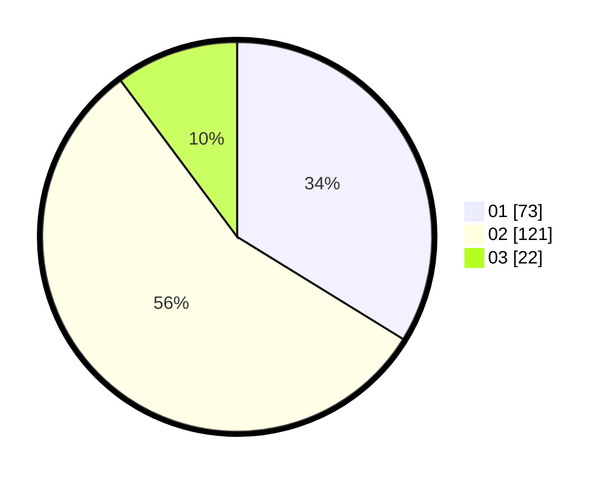

# Hasil

Hasil perolehan suara paslon dapat dilihat pada file paslon-01.txt, paslon-02.txt, dan paslon-03.txt.

Jika tidak ada, artinya data tersebut belum ada pada SIREKAP.

## Perolehan Suara

 * Paslon 01: **73**.
 * Paslon 02: **121**.
 * Paslon 03: **22**.

## Foto C Plano

https://sirekap-obj-formc.kpu.go.id/4a54/pemilu/ppwp/31/75/10/10/07/3175101007172-20240216-003227--6ada2faf-216d-4c28-82db-9505d82f5f58.jpg

https://sirekap-obj-formc.kpu.go.id/4a54/pemilu/ppwp/31/75/10/10/07/3175101007172-20240216-003230--0d3d6da3-c1d9-444c-a1f1-554c7a260250.jpg

https://sirekap-obj-formc.kpu.go.id/4a54/pemilu/ppwp/31/75/10/10/07/3175101007172-20240216-003228--6a517046-0253-4182-85ba-15f012fc6706.jpg

## DATA PEMILIH TETAP

Jumlah pemilih dalam DPT: **275**.
 * L: **128**.
 * P: **147**.

## DATA PENGGUNA HAK PILIH

Jumlah pengguna hak pilih dalam DPT: **218**.
 * L: **104**.
 * P: **114**.

Jumlah pengguna hak pilih dalam DPTb: **0**.
 * L: **0**.
 * P: **0**.

Jumlah pengguna hak pilih dalam DPK: **1**.
 * L: **1**.
 * P: **0**.

Jumlah pengguna hak pilih: **219**.
 * L: **105**.
 * P: **114**.

## JUMLAH SUARA SAH DAN TIDAK SAH

JUMLAH SELURUH SUARA SAH: **216**.

JUMLAH SUARA TIDAK SAH: **3**.

JUMLAH SELURUH SUARA SAH DAN SUARA TIDAK SAH: **219**.
