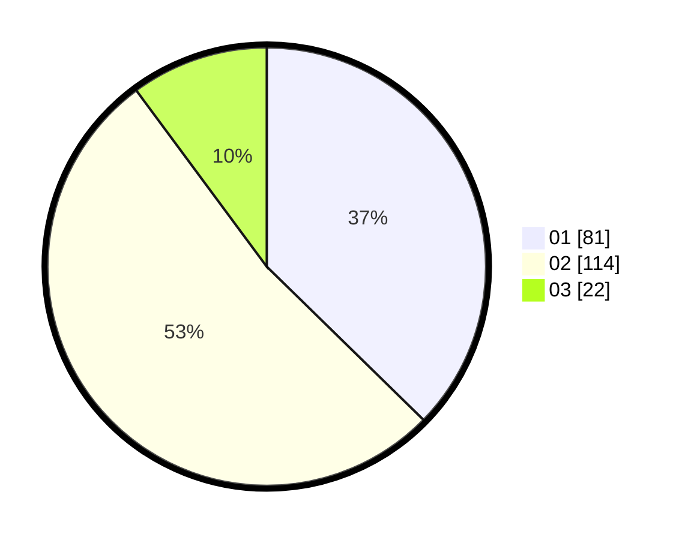

# Hasil

Hasil perolehan suara paslon dapat dilihat pada file paslon-01.txt, paslon-02.txt, dan paslon-03.txt.

Jika tidak ada, artinya data tersebut belum ada pada SIREKAP.

## Perolehan Suara

 * Paslon 01: **81**.
 * Paslon 02: **114**.
 * Paslon 03: **22**.

## Foto C Plano

https://sirekap-obj-formc.kpu.go.id/6c88/pemilu/ppwp/31/75/10/10/07/3175101007176-20240214-221909--a7926586-a0dc-485a-8f9e-56158e95f992.jpg

https://sirekap-obj-formc.kpu.go.id/6c88/pemilu/ppwp/31/75/10/10/07/3175101007176-20240216-230643--66bc802a-332a-4ce6-8e68-b8759f8a3803.jpg

https://sirekap-obj-formc.kpu.go.id/6c88/pemilu/ppwp/31/75/10/10/07/3175101007176-20240214-222025--974df9b9-85d4-4989-881a-9572aaabb612.jpg

## DATA PEMILIH TETAP

Jumlah pemilih dalam DPT: **276**.
 * L: **142**.
 * P: **134**.

## DATA PENGGUNA HAK PILIH

Jumlah pengguna hak pilih dalam DPT: **214**.
 * L: **108**.
 * P: **106**.

Jumlah pengguna hak pilih dalam DPTb: **2**.
 * L: **1**.
 * P: **1**.

Jumlah pengguna hak pilih dalam DPK: **5**.
 * L: **1**.
 * P: **4**.

Jumlah pengguna hak pilih: **221**.
 * L: **110**.
 * P: **111**.

## JUMLAH SUARA SAH DAN TIDAK SAH

JUMLAH SELURUH SUARA SAH: **217**.

JUMLAH SUARA TIDAK SAH: **4**.

JUMLAH SELURUH SUARA SAH DAN SUARA TIDAK SAH: **221**.
