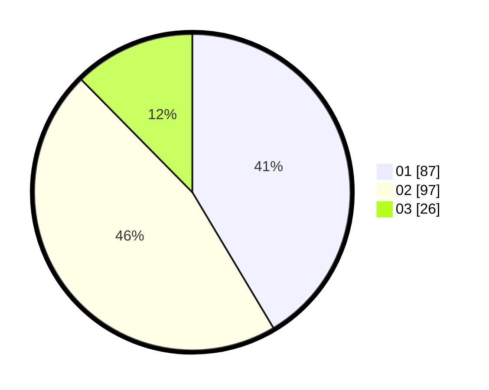

# Hasil

Hasil perolehan suara paslon dapat dilihat pada file paslon-01.txt, paslon-02.txt, dan paslon-03.txt.

Jika tidak ada, artinya data tersebut belum ada pada SIREKAP.

## Perolehan Suara

 * Paslon 01: **87**.
 * Paslon 02: **97**.
 * Paslon 03: **26**.

## Foto C Plano

https://sirekap-obj-formc.kpu.go.id/ab32/pemilu/ppwp/31/75/10/10/07/3175101007182-20240216-021307--858c0e17-51d0-4dac-8164-484165909feb.jpg

https://sirekap-obj-formc.kpu.go.id/ab32/pemilu/ppwp/31/75/10/10/07/3175101007182-20240216-020337--8602609f-cf8b-4b10-a63b-a6c6669e5dd2.jpg

https://sirekap-obj-formc.kpu.go.id/ab32/pemilu/ppwp/31/75/10/10/07/3175101007182-20240216-020328--e29462d6-1939-4879-928b-34d6303c09f5.jpg

## DATA PEMILIH TETAP

Jumlah pemilih dalam DPT: **267**.
 * L: **135**.
 * P: **132**.

## DATA PENGGUNA HAK PILIH

Jumlah pengguna hak pilih dalam DPT: **215**.
 * L: **101**.
 * P: **114**.

Jumlah pengguna hak pilih dalam DPTb: **0**.
 * L: **0**.
 * P: **0**.

Jumlah pengguna hak pilih dalam DPK: **2**.
 * L: **2**.
 * P: **0**.

Jumlah pengguna hak pilih: **217**.
 * L: **103**.
 * P: **114**.

## JUMLAH SUARA SAH DAN TIDAK SAH

JUMLAH SELURUH SUARA SAH: **210**.

JUMLAH SUARA TIDAK SAH: **7**.

JUMLAH SELURUH SUARA SAH DAN SUARA TIDAK SAH: **217**.
