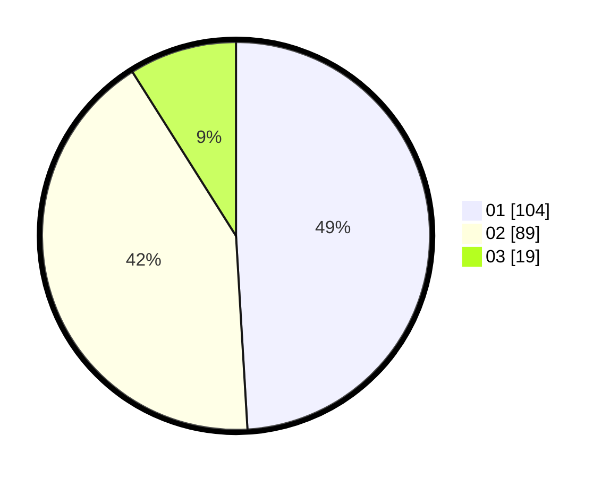

# Hasil

Hasil perolehan suara paslon dapat dilihat pada file paslon-01.txt, paslon-02.txt, dan paslon-03.txt.

Jika tidak ada, artinya data tersebut belum ada pada SIREKAP.

## Perolehan Suara

 * Paslon 01: **104**.
 * Paslon 02: **89**.
 * Paslon 03: **19**.

## Foto C Plano

https://sirekap-obj-formc.kpu.go.id/c642/pemilu/ppwp/31/75/10/10/07/3175101007186-20240215-234258--460ecaeb-a48a-4864-91d7-3f4c6c59c406.jpg

https://sirekap-obj-formc.kpu.go.id/c642/pemilu/ppwp/31/75/10/10/07/3175101007186-20240215-234300--90e268cf-e21c-496e-bdc1-8bda3701e38b.jpg

https://sirekap-obj-formc.kpu.go.id/c642/pemilu/ppwp/31/75/10/10/07/3175101007186-20240215-234259--cf672081-94f5-4c13-9721-aa0f3bb71861.jpg

## DATA PEMILIH TETAP

Jumlah pemilih dalam DPT: **213**.
 * L: **108**.
 * P: **105**.

## DATA PENGGUNA HAK PILIH

Jumlah pengguna hak pilih dalam DPT: **203**.
 * L: **102**.
 * P: **101**.

Jumlah pengguna hak pilih dalam DPTb: **0**.
 * L: **0**.
 * P: **0**.

Jumlah pengguna hak pilih dalam DPK: **10**.
 * L: **6**.
 * P: **4**.

Jumlah pengguna hak pilih: **213**.
 * L: **108**.
 * P: **105**.

## JUMLAH SUARA SAH DAN TIDAK SAH

JUMLAH SELURUH SUARA SAH: **212**.

JUMLAH SUARA TIDAK SAH: **1**.

JUMLAH SELURUH SUARA SAH DAN SUARA TIDAK SAH: **213**.
