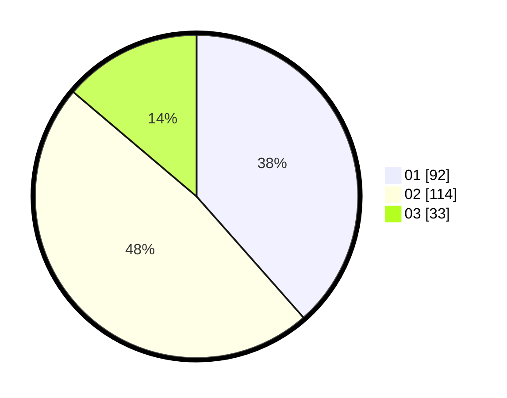

# Hasil

Hasil perolehan suara paslon dapat dilihat pada file paslon-01.txt, paslon-02.txt, dan paslon-03.txt.

Jika tidak ada, artinya data tersebut belum ada pada SIREKAP.

## Perolehan Suara

 * Paslon 01: **92**.
 * Paslon 02: **114**.
 * Paslon 03: **33**.

## Foto C Plano

https://sirekap-obj-formc.kpu.go.id/e66e/pemilu/ppwp/31/75/10/10/07/3175101007208-20240216-040353--d82df52d-8f81-451e-b09f-a5ea1ff447c0.jpg

https://sirekap-obj-formc.kpu.go.id/e66e/pemilu/ppwp/31/75/10/10/07/3175101007208-20240216-040354--c4176b41-2a38-4926-a5bf-f807103938ff.jpg

https://sirekap-obj-formc.kpu.go.id/e66e/pemilu/ppwp/31/75/10/10/07/3175101007208-20240216-040354--9e0c420e-c63f-47f1-afde-cbb8bd01b7cc.jpg

## DATA PEMILIH TETAP

Jumlah pemilih dalam DPT: **297**.
 * L: **146**.
 * P: **151**.

## DATA PENGGUNA HAK PILIH

Jumlah pengguna hak pilih dalam DPT: **238**.
 * L: **115**.
 * P: **123**.

Jumlah pengguna hak pilih dalam DPTb: **0**.
 * L: **0**.
 * P: **0**.

Jumlah pengguna hak pilih dalam DPK: **4**.
 * L: **2**.
 * P: **2**.

Jumlah pengguna hak pilih: **242**.
 * L: **117**.
 * P: **125**.

## JUMLAH SUARA SAH DAN TIDAK SAH

JUMLAH SELURUH SUARA SAH: **239**.

JUMLAH SUARA TIDAK SAH: **3**.

JUMLAH SELURUH SUARA SAH DAN SUARA TIDAK SAH: **242**.
