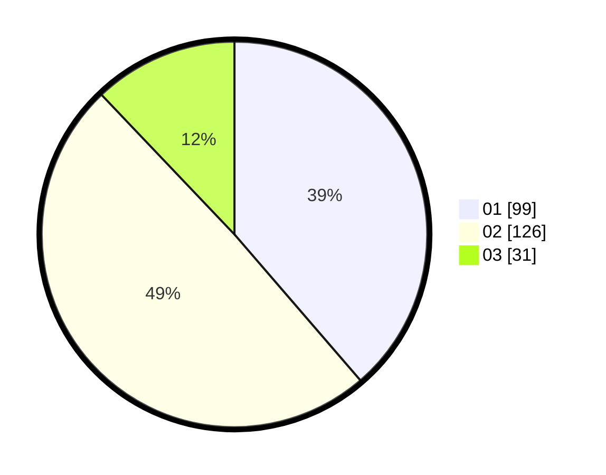

# Hasil

Hasil perolehan suara paslon dapat dilihat pada file paslon-01.txt, paslon-02.txt, dan paslon-03.txt.

Jika tidak ada, artinya data tersebut belum ada pada SIREKAP.

## Perolehan Suara

 * Paslon 01: **99**.
 * Paslon 02: **126**.
 * Paslon 03: **31**.

## Foto C Plano

https://sirekap-obj-formc.kpu.go.id/de5b/pemilu/ppwp/31/75/10/10/07/3175101007211-20240214-184843--0f823fee-a6f7-418c-8f3b-0c1374459896.jpg

https://sirekap-obj-formc.kpu.go.id/de5b/pemilu/ppwp/31/75/10/10/07/3175101007211-20240214-184853--d74403ad-4af6-4638-8323-b0a94ba4f15a.jpg

https://sirekap-obj-formc.kpu.go.id/de5b/pemilu/ppwp/31/75/10/10/07/3175101007211-20240214-184900--f93fe646-07a7-4d09-b447-e1ba71f01023.jpg

## DATA PEMILIH TETAP

Jumlah pemilih dalam DPT: **298**.
 * L: **157**.
 * P: **141**.

## DATA PENGGUNA HAK PILIH

Jumlah pengguna hak pilih dalam DPT: **254**.
 * L: **129**.
 * P: **125**.

Jumlah pengguna hak pilih dalam DPTb: **0**.
 * L: **0**.
 * P: **0**.

Jumlah pengguna hak pilih dalam DPK: **3**.
 * L: **2**.
 * P: **1**.

Jumlah pengguna hak pilih: **257**.
 * L: **131**.
 * P: **126**.

## JUMLAH SUARA SAH DAN TIDAK SAH

JUMLAH SELURUH SUARA SAH: **256**.

JUMLAH SUARA TIDAK SAH: **1**.

JUMLAH SELURUH SUARA SAH DAN SUARA TIDAK SAH: **257**.
