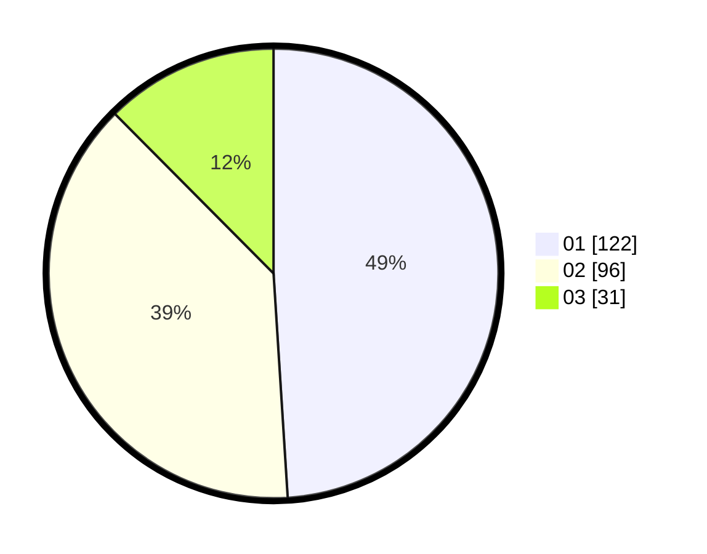

# Hasil

Hasil perolehan suara paslon dapat dilihat pada file paslon-01.txt, paslon-02.txt, dan paslon-03.txt.

Jika tidak ada, artinya data tersebut belum ada pada SIREKAP.

## Perolehan Suara

 * Paslon 01: **122**.
 * Paslon 02: **96**.
 * Paslon 03: **31**.

## Foto C Plano

https://sirekap-obj-formc.kpu.go.id/fa1d/pemilu/ppwp/31/75/10/10/07/3175101007212-20240214-195315--dedf1eb6-22e1-4bc9-ada0-2c2ed233a8bd.jpg

https://sirekap-obj-formc.kpu.go.id/fa1d/pemilu/ppwp/31/75/10/10/07/3175101007212-20240214-195318--6c4468e9-9e64-44ce-8605-233aee244d42.jpg

https://sirekap-obj-formc.kpu.go.id/fa1d/pemilu/ppwp/31/75/10/10/07/3175101007212-20240214-195320--ce1b1018-ae25-46ba-8083-6ce72a070ca7.jpg

## DATA PEMILIH TETAP

Jumlah pemilih dalam DPT: **297**.
 * L: **145**.
 * P: **152**.

## DATA PENGGUNA HAK PILIH

Jumlah pengguna hak pilih dalam DPT: **252**.
 * L: **125**.
 * P: **127**.

Jumlah pengguna hak pilih dalam DPTb: **2**.
 * L: **1**.
 * P: **1**.

Jumlah pengguna hak pilih dalam DPK: **0**.
 * L: **0**.
 * P: **0**.

Jumlah pengguna hak pilih: **254**.
 * L: **126**.
 * P: **128**.

## JUMLAH SUARA SAH DAN TIDAK SAH

JUMLAH SELURUH SUARA SAH: **249**.

JUMLAH SUARA TIDAK SAH: **5**.

JUMLAH SELURUH SUARA SAH DAN SUARA TIDAK SAH: **254**.
